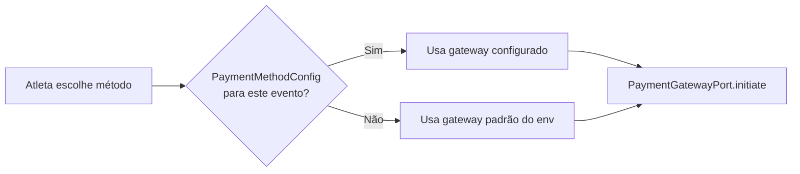

## Arquitetura de pagamentos

O Passo Giro usa uma arquitetura **agnóstica a gateway**: cada método de pagamento (PIX, cartão) é roteado para um gateway configurável por evento. Adicionar ou trocar um gateway não exige alteração no frontend nem nas regras de negócio.

```
Evento X  →  PIX    →  gateway A
          →  Cartão →  gateway B

Evento Y  →  PIX    →  gateway A (mesmo)
          →  Cartão →  gateway C (diferente)
```

O roteamento é definido pela tabela `PaymentMethodConfig` — uma entrada por (evento × método).

---

## PaymentMethodConfig — configuração por evento

Cada `PaymentMethodConfig` define para um evento e método:

| Campo | Descrição |
|-------|-----------|
| `method` | `PIX` ou `CREDIT_CARD` |
| `gateway` | Identificador do gateway a usar |
| `isActive` | Se o método está disponível para o atleta |
| `renderMode` | `INLINE` (QR na tela) ou `REDIRECT` (checkout externo) |
| `settlementHoldDays` | Dias de hold para cartão antes de liberar para saque |
| `maxInstallments` | Máximo de parcelas exibido ao atleta |

Eventos sem configuração no banco usam os **defaults de variáveis de ambiente** — comportamento igual ao anterior à implantação do sistema de roteamento.

---

## Gateways suportados

| Identificador | Método | Tipo de checkout |
|---------------|--------|-----------------|
| `woovi` | PIX | INLINE — QR Code exibido na tela |
| `asaas` | Cartão de crédito | REDIRECT — checkout hospedado |

<Info>
Outros gateways podem ser adicionados implementando a interface `PaymentGatewayPort` no backend. Nenhuma alteração no frontend é necessária enquanto o `renderMode` for o mesmo.
</Info>

---

## Configurando um gateway para um evento

1. Acesse **Admin → Organizadores → [nome do organizador] → Eventos → [evento] → Pagamentos**
2. Para cada método desejado, clique em **Configurar**
3. Selecione o **gateway** e preencha os campos de taxa:
   - `gatewayPercent` — percentual cobrado pelo gateway (ex: `3.49`)
   - `gatewayFixedCents` — taxa fixa em centavos (ex: `49` = R$0,49)
   - `anticipationPercent` — antecipação de recebíveis (se habilitada no gateway)
   - `platformFeeMode` — `ABSORB` (org absorve) ou `PASS_TO_PAYER` (repassa ao atleta)
   - `settlementHoldDays` — dias de hold (padrão: 32 para cartão)
4. Clique em **Salvar**

<Info>
As regras de taxa (`PaymentFeeRule`) podem ser configuradas por faixa de parcelas. Ex: 1× com 2,99%, 2–6× com 3,49%, 7–12× com 3,99%.
</Info>

---

## Configurando credenciais do gateway

As credenciais de cada gateway (chaves de API) são configuradas a nível de ambiente (variáveis de servidor), não por evento. Isso mantém dados sensíveis fora do banco de dados.

<Warning>
**Nunca** registre chaves de API em logs, banco de dados ou código fonte. Credenciais do gateway são tratadas como segredos — não aparecem em respostas de API nem em mensagens de erro do sistema.
</Warning>

### Configuração de webhooks

Cada gateway deve ter a URL de webhook configurada no seu painel:

```
https://api.passogiro.com.br/payments/webhook/{provider}
```

Substitua `{provider}` pelo identificador do gateway (ex: `woovi`, `asaas`).

O sistema valida a autenticidade de cada webhook de acordo com o mecanismo do gateway (IP allowlist, header de token, assinatura HMAC — depende do gateway).

---

## Testando o gateway

Após configurar, realize uma inscrição de teste no ambiente de sandbox:

1. Crie um evento de teste com preço baixo
2. Faça uma inscrição usando conta de atleta de teste
3. Complete o pagamento
4. Verifique se o webhook foi recebido e o status da inscrição atualizou

---

## Fluxo de roteamento

Quando um atleta seleciona a forma de pagamento:



Se não houver `PaymentMethodConfig` ativo para o método, a opção **não é exibida** para o atleta.

---

## Problemas comuns

| Problema | Causa provável | Solução |
|----------|---------------|---------|
| Método de pagamento não aparece para o atleta | `PaymentMethodConfig` inativo ou ausente | Verificar e ativar config do evento |
| Webhook não recebido | URL de webhook incorreta no painel do gateway | Corrigir URL para `/payments/webhook/{provider}` |
| Pagamento aprovado mas inscrição não atualiza | Falha no processamento do webhook | Ver logs em [Monitorar Pagamentos](/admin/monitorar-pagamentos) |
| Taxa incorreta | `PaymentFeeRule` desatualizada | Revisar regras de taxa na config do evento |
