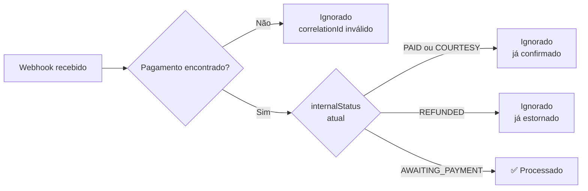

O Passo Giro expõe um único endpoint de webhook por gateway. Todos os eventos de pagamento (confirmação, expiração, cancelamento, estorno) chegam por aqui.

---

## Endpoint

```
POST /payments/webhook/{provider}
```

| Parâmetro | Valores aceitos |
|-----------|----------------|
| `provider` | `woovi`, `asaas` |

**Exemplos:**
```
POST https://api.passogiro.com.br/payments/webhook/woovi
POST https://api.passogiro.com.br/payments/webhook/asaas
```

---

## Autenticação

Cada gateway usa um mecanismo diferente de validação de autenticidade:

| Gateway | Mecanismo |
|---------|-----------|
| `woovi` | HMAC-SHA256 + header `x-webhook-signature` + IP allowlist |
| `asaas` | Token fixo no header `asaas-access-token` + IP allowlist |

<Warning>
Webhooks que não passam na validação de autenticidade são **rejeitados com HTTP 401** — nenhum efeito colateral ocorre. Os IPs de cada gateway devem estar habilitados nas regras de firewall do servidor.
</Warning>

---

## Resposta

O backend sempre responde com **HTTP 200** independentemente do resultado interno. Isso evita que o gateway reenvie indefinidamente um webhook que o sistema não consegue processar por razão de negócio (ex: inscrição já confirmada).

```json
{
  "ok": true,
  "processed": true,
  "reason": "Pagamento confirmado — inscrição PAID"
}
```

| Campo | Tipo | Descrição |
|-------|------|-----------|
| `ok` | `boolean` | Sempre `true` — indica que o backend processou a requisição sem erro de infraestrutura |
| `processed` | `boolean` | `true` se alguma ação foi tomada; `false` se o evento foi ignorado |
| `reason` | `string` | Descrição em português do que aconteceu — útil para debug de webhooks |

### Exemplos de `reason`

```
"Pagamento confirmado — inscrição PAID"
"Webhook ignorado: pagamento já estava PAID (idempotência)"
"Webhook ignorado: internalStatus REFUNDED — não reativa pagamento"
"Evento ignorado: PAYMENT_RESTORED não altera estado interno"
"Parcela 2 de 3 registrada — paidInstallments: 1 → 2"
"Webhook ignorado: gateway desconhecido 'xyz'"
```

---

## Mapeamento de eventos por gateway

### Woovi (PIX)

| Evento Woovi | `internalStatus` resultante | Ação |
|-------------|---------------------------|------|
| `OPENPIX:CHARGE_COMPLETED` | `PAID` | Confirma inscrição, credita saldo imediatamente |
| `OPENPIX:CHARGE_EXPIRED` | `EXPIRED` | Marca pagamento como expirado, libera vaga |
| `OPENPIX:CHARGE_REFUNDED` | `REFUNDED` | Marca estorno, decrementa saldo do evento |
| Outros eventos | — | Ignorados com `reason` descritivo |

### Asaas (Cartão)

| Evento Asaas | `internalStatus` resultante | Ação |
|-------------|---------------------------|------|
| `PAYMENT_RECEIVED` | `PAID` | Confirma inscrição (parcela 1 ou pagamento único) |
| `PAYMENT_CONFIRMED` | `PAID` | Idem — confirmação bancária definitiva |
| `PAYMENT_APPROVED_BY_RISK_ANALYSIS` | `PAID` | Aprovação após análise antifraude |
| `PAYMENT_AWAITING_RISK_ANALYSIS` | `PROCESSING` | Análise antifraude em andamento — polling exibe aviso ao atleta |
| `PAYMENT_REPROVED_BY_RISK_ANALYSIS` | `CANCELLED` | Reprovado por risco — `obs` contém motivo |
| `PAYMENT_OVERDUE` | `EXPIRED` | Vencimento sem pagamento |
| `PAYMENT_DECLINED` | `CANCELLED` | Recusado pela operadora — `obs` contém motivo |
| `PAYMENT_DELETED` | `CANCELLED` | Excluído no painel Asaas |
| `PAYMENT_REFUNDED` | `REFUNDED` | Estorno total processado |
| `PAYMENT_PARTIALLY_REFUNDED` | — | Ignorado (sem suporte a estorno parcial) |
| `PAYMENT_RESTORED` | — | Ignorado (não altera estado interno) |
| Outros eventos | — | Ignorados com `reason` descritivo |

---

## Idempotência

O sistema é **idempotente**: reenviar o mesmo webhook produz o mesmo resultado e não duplica cobranças ou créditos.



### Parcelas 2+

Para webhooks de parcelas subsequentes (2, 3, …, N), o sistema verifica que o `installmentGroupId` corresponde a um pagamento já `PAID`. A operação é somente de auditoria (`paidInstallments += 1`) — nenhum crédito adicional é gerado.

Se o mesmo webhook de parcela for reenviado, o campo `paidInstallments` pode ser incrementado novamente — gateways maduros não reenviam confirmações já processadas, mas o campo é informativo e não afeta saldos financeiros.

---

## Configuração nos painéis dos gateways

### Woovi

No painel da Woovi, configure a URL de webhook e o segredo HMAC:

```
URL:     https://api.passogiro.com.br/payments/webhook/woovi
Método:  POST
Eventos: OPENPIX:CHARGE_COMPLETED, OPENPIX:CHARGE_EXPIRED, OPENPIX:CHARGE_REFUNDED
```

O segredo HMAC deve ser configurado na variável de ambiente `WOOVI_APP_ID`.

### Asaas

No painel do Asaas, configure o token de webhook:

```
URL:    https://api.passogiro.com.br/payments/webhook/asaas
Método: POST
```

O token deve ser configurado na variável de ambiente `ASAAS_WEBHOOK_TOKEN`.

---

## Configuração de IPs (firewall)

Para segurança adicional, o backend valida o IP de origem de cada webhook. Configure as variáveis de ambiente com os CIDRs publicados por cada gateway:

| Variável | Uso |
|----------|-----|
| `WOOVI_ALLOWED_IPS` | Lista separada por vírgula dos IPs da Woovi |
| `ASAAS_ALLOWED_IPS` | Lista separada por vírgula dos IPs do Asaas |

<Info>
Consulte a documentação de cada gateway para a lista atualizada de IPs de saída dos webhooks. IPs não listados resultam em rejeição com HTTP 401.
</Info>

---

## Exemplos de payload

### Woovi — OPENPIX:CHARGE_COMPLETED

```json
{
  "event": "OPENPIX:CHARGE_COMPLETED",
  "charge": {
    "correlationID": "aaaaaaaa-bbbb-cccc-dddd-111111111111",
    "value": 5000,
    "status": "COMPLETED",
    "paidAt": "2025-06-01T14:32:00Z"
  }
}
```

### Asaas — PAYMENT_RECEIVED (parcela 1)

```json
{
  "event": "PAYMENT_RECEIVED",
  "payment": {
    "id": "pay_abc123",
    "customer": "cus_xyz",
    "value": 58.04,
    "netValue": 55.50,
    "installment": "inst_group_001",
    "installmentNumber": 1,
    "installmentCount": 3,
    "status": "RECEIVED",
    "paymentDate": "2025-06-01"
  }
}
```

### Asaas — PAYMENT_AWAITING_RISK_ANALYSIS

```json
{
  "event": "PAYMENT_AWAITING_RISK_ANALYSIS",
  "payment": {
    "id": "pay_abc456",
    "value": 58.04,
    "status": "AWAITING_RISK_ANALYSIS"
  }
}
```

Quando esse evento é recebido, o campo `Payment.internalStatus` é atualizado para `PROCESSING`. O polling do frontend detecta esse status e exibe ao atleta: *"Análise de risco em andamento — aguarde."*
