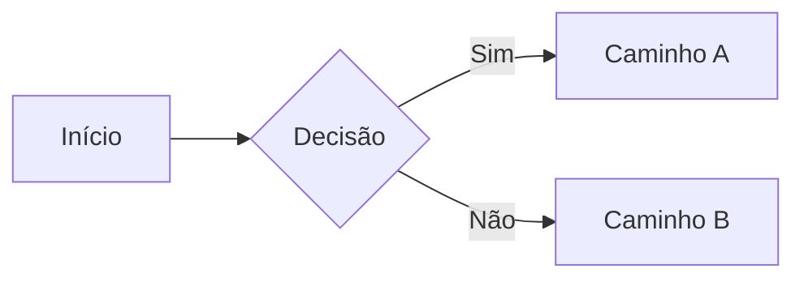
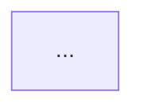

> Arquivo de referência interno. Não está na navegação pública.
> Última atualização: Maio 2026.

---

## Callouts (Destaques)

Seis tipos pré-definidos + um genérico customizável.

```mdx
<Note>Nota informativa neutra.</Note>
<Info>Informação importante.</Info>
<Tip>Dica útil para o leitor.</Tip>
<Warning>Atenção — algo que pode dar errado.</Warning>
<Check>Confirmação de algo correto / feito.</Check>
<Danger>Perigo — consequência grave.</Danger>
```

### Callout customizado

```mdx
<Callout icon="key" color="#FFC107" iconType="regular">
  Conteúdo com ícone e cor personalizados.
</Callout>
```

| Prop | Tipo | Descrição |
|------|------|-----------|
| `icon` | string | Font Awesome, Lucide, Tabler, URL externa, caminho local ou SVG inline em `{}` |
| `iconType` | string | `regular` `solid` `light` `thin` `sharp-solid` `duotone` `brands` |
| `color` | string | Hex (ex: `#FFC107`) — afeta borda, fundo e texto |

---

## Card e CardGroup

```mdx
<CardGroup cols={2}>
  <Card
    title="Título"
    icon="rocket"
    iconType="solid"
    color="#16A34A"
    href="/destino"
    horizontal={false}
    img="/images/capa.png"
    cta="Saiba mais"
    arrow={true}
    type="info"
  >
    Conteúdo do card (opcional).
  </Card>
</CardGroup>
```

| Prop | Tipo | Descrição |
|------|------|-----------|
| `title` | string | Título do card |
| `icon` | string | Ícone |
| `iconType` | string | Estilo FA |
| `color` | string | Cor do ícone em hex |
| `href` | string | Torna o card clicável |
| `horizontal` | boolean | Layout horizontal (ícone à esquerda) |
| `img` | string | Imagem de capa no topo |
| `cta` | string | Texto do link no rodapé |
| `arrow` | boolean | Exibe seta no canto |
| `type` | string | `info` `warning` `note` `tip` `check` `danger` |

---

## Columns e Column

Layout responsivo em grade para conteúdo livre (não apenas Cards).

```mdx
<Columns cols={3}>
  <Column>
    **Conteúdo esquerdo**
    Qualquer markdown ou componente.
  </Column>
  <Column>
    **Conteúdo central**
  </Column>
  <Column>
    **Conteúdo direito**
  </Column>
</Columns>
```

| Prop `Columns` | Tipo | Descrição |
|----------------|------|-----------|
| `cols` | 1–4 | Número de colunas. Ajusta automaticamente em telas menores. |

---

## Steps e Step

```mdx
<Steps titleSize="h3">
  <Step title="Título do passo" icon="key" id="ancora" noAnchor={false}>
    Conteúdo do passo.
  </Step>
  <Step title="Próximo" stepNumber={2}>Conteúdo.</Step>
</Steps>
```

| Prop `Steps` | Tipo | Default | Descrição |
|--------------|------|---------|-----------|
| `titleSize` | string | `p` | `p` `h2` `h3` `h4` |

| Prop `Step` | Tipo | Descrição |
|-------------|------|-----------|
| `title` | string | **Obrigatório** |
| `icon` | string | Ícone personalizado |
| `iconType` | string | Estilo FA |
| `stepNumber` | number | Numeração manual |
| `id` | string | Âncora personalizada |
| `noAnchor` | boolean | Oculta link de âncora |

---

## Tabs e Tab

```mdx
<Tabs defaultTabIndex={0} sync={true} borderBottom={true}>
  <Tab title="JavaScript" id="js" icon="js" iconType="brands">
    Conteúdo JS.
  </Tab>
  <Tab title="Python">Conteúdo Python.</Tab>
</Tabs>
```

| Prop `Tabs` | Tipo | Default | Descrição |
|-------------|------|---------|-----------|
| `defaultTabIndex` | number | `0` | Aba ativa por padrão (zero-based) |
| `sync` | boolean | `true` | Sincroniza com outras Tabs/CodeGroups de mesmo título |
| `borderBottom` | boolean | — | Adiciona borda inferior e padding |

| Prop `Tab` | Tipo | Descrição |
|------------|------|-----------|
| `title` | string | **Obrigatório** |
| `id` | string | Âncora personalizada (padrão = title) |
| `icon` | string | Ícone |
| `iconType` | string | Estilo FA |

---

## Accordions e AccordionGroup

```mdx
<AccordionGroup>
  <Accordion
    title="Título visível"
    description="Subtítulo opcional"
    defaultOpen={false}
    id="ancora"
    icon="chevron-right"
    iconType="solid"
  >
    Conteúdo oculto até expandir.
  </Accordion>
</AccordionGroup>
```

| Prop | Tipo | Default | Descrição |
|------|------|---------|-----------|
| `title` | string | **Obrigatório** | Cabeçalho |
| `description` | string | — | Detalhe abaixo do título |
| `defaultOpen` | boolean | `false` | Expandido por padrão |
| `id` | string | — | Âncora personalizada |
| `icon` | string | — | Ícone |
| `iconType` | string | — | Estilo FA |

---

## Badge

```mdx
<Badge
  color="green"
  size="sm"
  shape="pill"
  icon="circle-check"
  iconType="solid"
  stroke={false}
  disabled={false}
>
  Ativo
</Badge>
```

| Prop | Tipo | Default | Opções |
|------|------|---------|--------|
| `color` | string | `gray` | `gray` `blue` `green` `yellow` `orange` `red` `purple` `white` `surface` `white-destructive` `surface-destructive` |
| `size` | string | `md` | `xs` `sm` `md` `lg` |
| `shape` | string | `rounded` | `rounded` `pill` |
| `icon` | string | — | |
| `iconType` | string | — | Estilo FA |
| `stroke` | boolean | `false` | Aparência outline |
| `disabled` | boolean | `false` | Opacidade reduzida |

---

## Tooltip

```mdx
<Tooltip
  tip="Definição ou explicação do termo."
  headline="Título opcional"
  cta="Ver documentação"
  href="/destino"
>
  termo técnico
</Tooltip>
```

| Prop | Obrigatório | Descrição |
|------|-------------|-----------|
| `tip` | **Sim** | Explicação exibida ao hover |
| `headline` | Não | Título acima do tip |
| `cta` | Não | Texto do link de ação |
| `href` | Não | URL (`cta` + `href` sempre juntos) |

---

## Frame

Envolve imagens e vídeos com borda estilizada e legenda.

```mdx
<Frame
  caption="Legenda com suporte a [Markdown](https://exemplo.com)."
  hint="Texto exibido antes do frame"
>
  
</Frame>
```

Vídeos com `autoPlay` recebem automaticamente `playsInline loop muted`:

```mdx
<Frame caption="Demo do produto">
  <video autoPlay src="/videos/demo.mp4" />
</Frame>
```

| Prop | Descrição |
|------|-----------|
| `caption` | Texto centralizado abaixo (aceita Markdown) |
| `hint` | Texto antes do frame |

---

## Imagens

### Sintaxe básica

```mdx

```

### Controle de tamanho

```mdx

```

### Variantes claro/escuro

```mdx


```

### Desabilitar zoom ao clicar

```mdx

```

### Embed de vídeo YouTube

```mdx
<iframe
  width="560" height="315"
  src="https://www.youtube.com/embed/VIDEO_ID"
  title="Título do vídeo"
  allowFullScreen
/>
```

### Vídeo local

```mdx
<video controls autoPlay muted loop>
  <source src="/video.mp4" type="video/mp4" />
</video>
```

> **Limite de arquivo:** 20 MB. Arquivos maiores devem ser hospedados em CDN externo.

---

## Code Block

````mdx
```javascript filename="src/app.js" icon="square-js" lines highlight={1-2} focus={3} expandable wrap
const hello = "world";
function sayHello() {
  console.log(hello);
}
```
````

| Meta-opção | Descrição |
|------------|-----------|
| `filename="path"` | Nome do arquivo na aba |
| `icon="nome"` | Ícone de linguagem |
| `lines` | Numeração de linhas |
| `highlight={1-2,5}` | Destaca linhas em verde |
| `focus={2,4-5}` | Escurece tudo exceto as linhas |
| `expandable` | Bloco colapsável |
| `wrap` | Quebra linha em vez de scroll |

### Diff

```javascript
return a + b; // [!code --]
return a + b + 0; // [!code ++]
```

### CodeGroup — múltiplas linguagens

````mdx
<CodeGroup>
  ```javascript title="Node.js"
  const res = await fetch('/api');
  ```
  ```python title="Python"
  import requests
  res = requests.get('/api')
  ```
</CodeGroup>
````

---

## Mermaid Diagrams

Diagramas interativos com zoom e pan nativos.

````mdx

````

Para diagramas complexos — layout ELK:

````mdx

````

Posição dos controles de zoom:

````mdx
```mermaid placement="top-left"
sequenceDiagram
  ...
```
````

**Tipos suportados:** `flowchart`, `sequenceDiagram`, `stateDiagram-v2`, `gantt`, `classDiagram`, `erDiagram`, `journey`, `gitGraph`, `pie`.

---

## Listas e Tabelas

### Listas

```mdx
- Item não ordenado
* Também funciona
+ E isso também

1. Item ordenado
2. Segundo item
   - Sublista indentada
   - Outro sub-item
```

### Tabelas com alinhamento

```mdx
| Esquerda | Centro | Direita |
|:---------|:------:|--------:|
| texto    | texto  |   texto |
```

---

## Snippets Reutilizáveis

Coloque arquivos `.mdx` em `/snippets/` — não renderizam como páginas.

```mdx
// snippets/aviso-beta.mdx
<Warning>Este recurso está em beta e pode mudar.</Warning>
```

Importe em qualquer página:

```mdx
import AvisoBeta from "/snippets/aviso-beta.mdx";

<AvisoBeta />
```

### Snippet com variável

```mdx
// snippets/saudacao.mdx
Olá, {nome}!
```

```mdx
import Saudacao from "/snippets/saudacao.mdx";

<Saudacao nome="Israel" />
```

### Snippet com variável exportada

```mdx
// snippets/versao.mdx
export const versao = "2.5.0";
```

```mdx
import { versao } from "/snippets/versao.mdx";

Versão atual: {versao}
```

> Imports aninhados não são suportados — importe todos os componentes diretamente na página pai.

---

## Changelog (Update)

```mdx
<Update label="Maio 2026" description="v2.5.0" tags={["Feature", "Bug Fix"]}>
  ### Nova funcionalidade X

  Descrição da funcionalidade com **markdown**, imagens e links.
</Update>
```

| Prop | Descrição |
|------|-----------|
| `label` | Título da entrada (aparece no sumário lateral) |
| `description` | Versão ou subtítulo |
| `tags` | Array de tags para filtro (`["Feature", "Bug Fix"]`) |

Para habilitar RSS:

```mdx
---
title: "Changelog"
rss: true
---
```

Feed disponível em `/changelog/rss.xml`.

---

## Panel (Painel lateral)

Substitui o sumário da página por conteúdo customizado:

```mdx
<Panel>
  <Info>Conteúdo fixado no painel lateral direito.</Info>
</Panel>
```

> `Panel` substitui completamente o sumário. Coloque `RequestExample` e `ResponseExample` dentro do `Panel` quando ele existir na página.

---

## Frontmatter da página

```mdx
---
title: "Título da página"
description: "Descrição para SEO e listagens"
icon: "rocket"
iconType: "solid"
mode: "wide"
sidebarTitle: "Título curto no sidebar"
---
```

| Campo | Descrição |
|-------|-----------|
| `title` | Título principal (H1) |
| `description` | Meta description + subtítulo |
| `icon` | Ícone no sidebar |
| `iconType` | Estilo FA |
| `mode` | `wide` para layout sem sidebar, `custom` para layout livre |
| `sidebarTitle` | Título alternativo no menu lateral (quando `title` é longo) |

---

## Componentes React customizados

Defina inline em `.mdx` usando hooks React:

```mdx
export const Contador = () => {
  const [n, setN] = React.useState(0);
  return (
    <div>
      <button onClick={() => setN(n + 1)}>Cliques: {n}</button>
    </div>
  );
};

<Contador />
```

Ou coloque em `/snippets/MeuComponente.jsx` e importe:

```mdx
import MeuComponente from "/snippets/MeuComponente.jsx";

<MeuComponente prop="valor" />
```

> Imports aninhados não são suportados — sempre importe diretamente na página.

---

## Scripts e CSS customizados

Qualquer arquivo `.js` na raiz do repositório é incluído automaticamente em todas as páginas:

```javascript
// analytics.js — incluído em todas as páginas
window.dataLayer = window.dataLayer || [];
function gtag() { dataLayer.push(arguments); }
gtag('js', new Date());
gtag('config', 'G-XXXXXXXXXX');
```

Qualquer arquivo `.css` na raiz aplica estilos globais:

```css
/* custom.css */
#navbar { background: #16A34A; }
```

> ⚠️ Use com cuidado para não introduzir vulnerabilidades de segurança.

---

## Configuração em docs.json

### Temas disponíveis

| Tema | Ideal para |
|------|-----------|
| `mint` | Documentação técnica clássica (atual) |
| `maple` | SaaS e produtos de tecnologia modernos |
| `palm` | Documentação financeira empresarial |
| `willow` | Conteúdo minimalista, foco total no texto |
| `linden` | Estética retro / monospace |
| `almond` | Layout baseado em cards, navegação simplificada |
| `aspen` | Estruturas complexas e elementos interativos |
| `sequoia` | Bibliotecas de documentação extensas |
| `luma` | Apresentação polida e clara |

```json
{ "theme": "mint" }
```

### Fontes

```json
"fonts": {
  "family": "Inter"
}
```

Fonte separada para headings e body:

```json
"fonts": {
  "heading": {
    "family": "Cal Sans",
    "source": "https://cdn.example.com/CalSans.woff2",
    "format": "woff2",
    "weight": 600
  },
  "body": {
    "family": "Inter"
  }
}
```

Fonte local:

```json
"fonts": {
  "family": "InterDisplay",
  "source": "/fonts/InterDisplay-Regular.woff2",
  "format": "woff2",
  "weight": 400
}
```

### Página 404 customizada

```json
"errors": {
  "404": {
    "redirect": false,
    "title": "Página não encontrada",
    "description": "Esta página não existe. Veja a [documentação principal](/)."
  }
}
```

| Campo | Descrição |
|-------|-----------|
| `redirect` | `true` = redireciona para home; `false` = exibe a 404 |
| `title` | Título customizado |
| `description` | Aceita MDX (links, bold, italic, componentes) |

O Mintlify exibe automaticamente sugestões de páginas relacionadas na 404.

---

## Ícones disponíveis

Mintlify aceita ícones de três bibliotecas por nome:

- **Lucide** (padrão) — [lucide.dev/icons](https://lucide.dev/icons)
- **Font Awesome 6** — [fontawesome.com/icons](https://fontawesome.com/icons) (requer `iconType`)
- **Tabler Icons** — [tabler.io/icons](https://tabler.io/icons)

Também aceita:
- URL externa: `icon="https://..."`
- Caminho local: `icon="/images/icone.svg"`
- SVG inline: `icon={<svg>...</svg>}`
