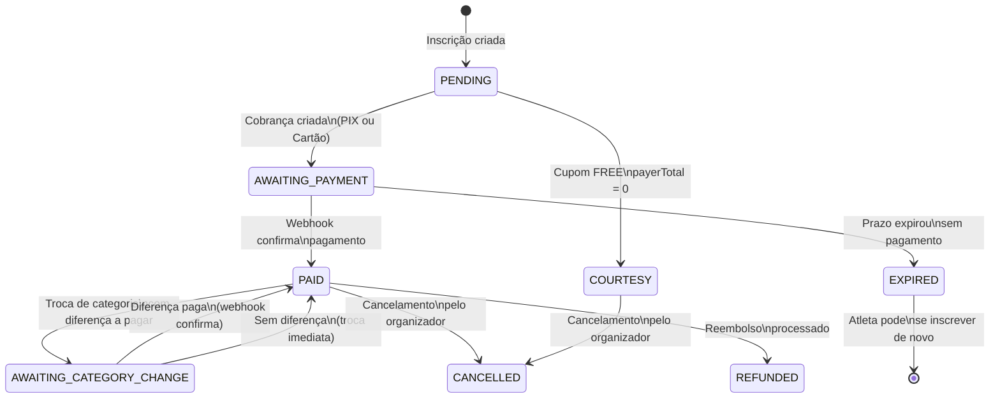

## Estados possíveis

| Status | <Badge color="gray" size="xs">Descrição</Badge> |
|--------|-----------|
| <Badge color="yellow">PENDING</Badge> | Inscrição iniciada, nenhuma cobrança gerada ainda |
| <Badge color="orange">AWAITING_PAYMENT</Badge> | Cobrança criada no gateway, aguardando pagamento |
| <Badge color="green">PAID</Badge> | Pagamento confirmado — inscrição ativa |
| <Badge color="green" icon="gift">COURTESY</Badge> | Cupom de cortesia — ativa sem pagamento |
| <Badge color="blue">AWAITING_CATEGORY_CHANGE</Badge> | Troca solicitada, aguardando pagamento da diferença |
| <Badge color="red">CANCELLED</Badge> | Inscrição cancelada |
| <Badge color="purple">REFUNDED</Badge> | Pagamento estornado ao atleta |
| <Badge color="gray">EXPIRED</Badge> | Prazo de pagamento encerrou sem confirmação |

---

## Diagrama de transições

---

## Transições em detalhe

<AccordionGroup>
  <Accordion title="PENDING → AWAITING_PAYMENT" icon="credit-card">
    Quando o atleta escolhe a forma de pagamento e confirma, o sistema:

    1. Cria a cobrança no gateway (Woovi para PIX, Asaas para cartão)
    2. Armazena o `providerPaymentId`
    3. Atualiza o status para `AWAITING_PAYMENT`
    4. Retorna o QR Code (PIX) ou confirmação de cobrança direta (Cartão)
  </Accordion>

  <Accordion title="PENDING → COURTESY" icon="gift">
    Quando o cupom é do tipo `FREE` (`payerTotalCents = 0`):

    - Nenhuma cobrança é criada no gateway
    - O backend cria `Payment` com status `COURTESY` diretamente
    - A inscrição é confirmada imediatamente
    - O atleta recebe e-mail de confirmação e pode acessar o QR Code
  </Accordion>

  <Accordion title="AWAITING_PAYMENT → PAID" icon="circle-check">
    Ocorre quando o webhook do gateway confirma o pagamento:

    1. Gateway processa o pagamento
    2. Envia `POST /payments/webhook/{gateway}` ao backend
    3. Backend valida a assinatura do webhook
    4. Verifica idempotência (status deve ser `AWAITING_PAYMENT`)
    5. Atualiza status para `PAID`
    6. Dispara e-mail de confirmação
    7. Atualiza saldo financeiro do evento
  </Accordion>

  <Accordion title="AWAITING_PAYMENT → EXPIRED" icon="clock">
    Se o prazo de pagamento expirar:

    - **PIX**: 30 minutos (controlado pela Woovi)
    - **Cartão**: a cobrança expira conforme a política do gateway; o webhook de expiração é recebido normalmente

    O gateway envia webhook de expiração. O backend atualiza para `EXPIRED` e a vaga na categoria é **liberada automaticamente**.
  </Accordion>

  <Accordion title="PAID → AWAITING_CATEGORY_CHANGE" icon="arrow-right-arrow-left">
    Quando o atleta solicita troca de categoria:

    1. Registro `CategoryChange` é criado
    2. Status vai para `AWAITING_CATEGORY_CHANGE`
    3. Se há diferença de valor → nova cobrança com `correlationId = {registrationId}-change-{changeId}`
    4. Após pagamento → status volta para `PAID` na nova categoria

    Sem diferença de valor → troca processada imediatamente, status permanece `PAID`.

    Veja [Troca de Categoria](/sistema/troca-categoria).
  </Accordion>
</AccordionGroup>

---

## Acesso à página de pagamento

A tela `/pagamento/{id}` verifica o status da inscrição logo na carga — antes de qualquer interação do atleta. Apenas inscrições nos estados abaixo **permitem** o fluxo de pagamento; os demais exibem uma tela de bloqueio imediatamente.

| Status | Acesso | Tela exibida |
|--------|--------|-------------|
| `AWAITING_PAYMENT` | ✅ | Seleção de método / QR Code / Checkout |
| `AWAITING_CATEGORY_CHANGE` | ✅ | Fluxo de pagamento da diferença de categoria |
| `PAID` / `CATEGORY_CHANGED` | ⛔ | Tela de sucesso com comprovante |
| `COURTESY` | ⛔ | "Você está inscrito! Inscrição cortesia — nenhum pagamento necessário." |
| `CANCELLED` | ⛔ | "Esta inscrição foi cancelada." |
| `EXPIRED` | ⛔ | "O prazo de pagamento expirou." |
| `REFUNDED` | ⛔ | "O pagamento desta inscrição foi estornado." |
| `PENDING` | ⛔ | "Inscrição em análise — aguarde aprovação do organizador." |

<Info>
A verificação ocorre em dois momentos independentes: primeiro quando o `registrationPaymentSummary` retorna (guarda rápido, ainda na montagem da página), e depois quando o `checkPaymentStatus` completa (redundância). Isso garante que inscrições em estado inválido sejam bloqueadas antes de qualquer tentativa de geração de cobrança.
</Info>

---

## Inscrições simultâneas

<Warning>
O sistema permite apenas **uma inscrição ativa por atleta por evento**. Se o atleta tentar se inscrever novamente com uma inscrição `PAID`, `COURTESY` ou `AWAITING_PAYMENT` ativa, o sistema bloqueia e exibe mensagem de erro.

Inscrições com status `EXPIRED` ou `CANCELLED` não contam como ativas.
</Warning>

## Após expirar

Ao expirar, o atleta pode se inscrever novamente do zero. O preço será o **preço atual da categoria** — a inscrição expirada não é reativada.
