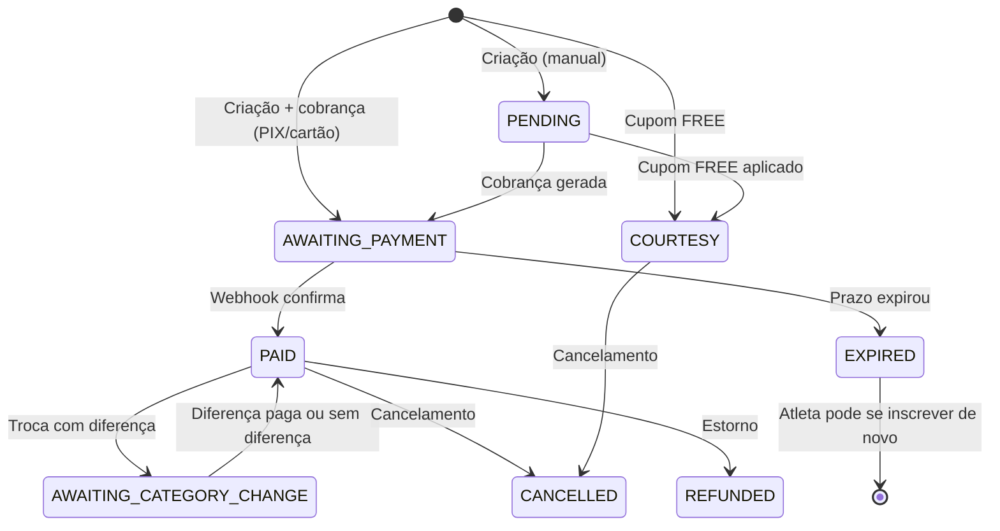

Esta página é a **referência canônica** para todos os valores de status que circulam pelo sistema. Use-a para entender o que cada valor significa, quando é atribuído e qual impacto tem no fluxo.

---

## Inscrição (`RegistrationStatus`)

Status da inscrição do atleta no evento. Controla se ela está ativa, aguardando pagamento, concluída ou encerrada.

| Status | Badge | Quando ocorre | Inscrição ativa? |
|--------|-------|---------------|-----------------|
| `PENDING` | <Badge color="yellow">PENDING</Badge> | Inscrição criada pelo organizador (inscrição manual), sem cobrança ainda | Reservada |
| `AWAITING_PAYMENT` | <Badge color="orange">AWAITING_PAYMENT</Badge> | Cobrança criada no gateway (PIX ou cartão); atleta ainda não pagou | Reservada |
| `PAID` | <Badge color="green">PAID</Badge> | Pagamento confirmado via webhook do gateway | ✅ Ativa |
| `COURTESY` | <Badge color="green">COURTESY</Badge> | Cupom FREE aplicado — inscrição confirmada sem cobrança | ✅ Ativa |
| `AWAITING_CATEGORY_CHANGE` | <Badge color="blue">AWAITING_CATEGORY_CHANGE</Badge> | Atleta solicitou troca de categoria; aguardando pagamento da diferença | ✅ Ativa |
| `CANCELLED` | <Badge color="red">CANCELLED</Badge> | Cancelada pelo organizador ou pela plataforma | ❌ Encerrada |
| `REFUNDED` | <Badge color="purple">REFUNDED</Badge> | Pagamento estornado ao atleta | ❌ Encerrada |
| `EXPIRED` | <Badge color="gray">EXPIRED</Badge> | Prazo de pagamento encerrou sem confirmação; vaga liberada automaticamente | ❌ Encerrada |

<Info>
Apenas inscrições com status `PAID`, `COURTESY` e `AWAITING_CATEGORY_CHANGE` permitem check-in no dia do evento.
Inscrições `EXPIRED` e `CANCELLED` **não** bloqueiam nova inscrição — o atleta pode se inscrever novamente do zero.
</Info>

### Diagrama de transições

---

## Status interno do pagamento (`Payment.internalStatus`)

Status **normalizado** do pagamento — independente do gateway. O frontend usa exclusivamente este campo para tomar decisões de UI; o `providerStatus` (status raw do gateway) é apenas para auditoria.

| `internalStatus` | Quando é atribuído | O que significa para o frontend |
|-----------------|-------------------|--------------------------------|
| `AWAITING_PAYMENT` | Cobrança criada no gateway | Aguardando pagamento — polling ativo |
| `PAID` | Webhook de confirmação recebido | Pagamento confirmado — exibe tela de sucesso |
| `PROCESSING` | Webhook `PAYMENT_AWAITING_RISK_ANALYSIS` (Asaas) | Análise antifraude em andamento — CARD_PENDING com aviso |
| `EXPIRED` | Webhook de expiração recebido | Pagamento expirou — PIX: pode gerar novo; Cartão: erro |
| `CANCELLED` | Webhook de cancelamento/recusa recebido | Pagamento recusado — exibe motivo e botão "Tentar novamente" |
| `REFUNDED` | Webhook de estorno recebido | Inscrição encerrada por reembolso |
| `COURTESY` | Cupom FREE — sem cobrança | Confirmação direta sem webhook |

<Note>
O campo `obs` em `Payment` complementa o `internalStatus`: registra o motivo legível da transição (ex: `"Saldo insuficiente"`, `"Reprovado por análise de risco"`). É exibido ao atleta quando disponível na tela de pagamento não confirmado.
</Note>

---

## Status de liquidação (`PaymentClearanceStatus`)

Controla quando o dinheiro de um pagamento fica disponível para saque pelo organizador.

| Status | Quando ocorre | Impacto nos saldos |
|--------|--------------|-------------------|
| `NOT_APPLICABLE` | Cortesia, pagamento em rascunho, cancelado ou não concluído | Sem impacto em `totalNetReceived` |
| `IMMEDIATE` | PIX confirmado (`PAID`) | Creditado imediatamente em `totalNetReceived` |
| `PENDING` | Cartão confirmado (`PAID`) em período de hold | Entra em `totalPendingClearance`; aguarda `availableAt` |
| `CLEARED` | Cron diário: `availableAt ≤ hoje` | Movido de `totalPendingClearance` → `totalNetReceived`; disponível para saque |

Veja detalhes em [Liquidação](/sistema/liquidacao).

---

## Status de troca de categoria (`CategoryChangeStatus`)

Ciclo de vida de uma solicitação de troca de categoria.

| Status | Descrição |
|--------|-----------|
| `PENDING` | Solicitação criada; aguardando ação do sistema |
| `AWAITING_PAYMENT` | Diferença calculada e cobrança gerada; atleta ainda não pagou |
| `PROCESSING_PAYMENT` | Pagamento submetido; aguardando confirmação do gateway |
| `CONFIRMED` | Troca concluída — atleta está na nova categoria |
| `EXPIRED` | Prazo de pagamento da diferença expirou; troca cancelada |
| `CANCELLED` | Troca cancelada antes da conclusão |
| `REJECTED` | Troca rejeitada pelo organizador ou pelas regras do evento |

---

## Método de pagamento (`PaymentMethod`)

Registrado na inscrição e no pagamento no momento da confirmação.

| Valor | Descrição |
|-------|-----------|
| `PIX` | Pagamento via PIX (gateway Woovi) |
| `CREDIT_CARD` | Cartão de crédito (gateway Asaas, cobrança direta) |
| `BANK_SLIP` | Boleto bancário (não habilitado na versão atual) |
| `COURTESY` | Inscrição cortesia — sem movimentação financeira |

---

## Modo de taxa da plataforma (`PlatformFeeMode`)

Define quem paga a taxa da plataforma: o organizador ou o atleta.

| Valor | Quem paga | Atleta vê a taxa? |
|-------|-----------|-----------------|
| `ABSORB` | Organizador absorve — a taxa sai do repasse | Não — apenas o preço base aparece |
| `PASS_TO_PAYER` | Atleta paga — somada ao preço base | Sim — aparece como "Taxa de serviço" no checkout |

O `platformFeeMode` é salvo como **snapshot** no `Payment` no momento da criação — mudanças posteriores na configuração do evento não afetam pagamentos já realizados.

---

## Status de saque (`WithdrawalStatus`)

Ciclo de vida de uma solicitação de saque pelo organizador.

| Status | Descrição |
|--------|-----------|
| `PENDING` | Solicitação enviada; aguardando aprovação do admin |
| `CONFIRMED` | Saque aprovado e processado — valor transferido |
| `REJECTED` | Saque rejeitado pelo admin (ex: saldo insuficiente, dados bancários inválidos) |

---

## Numeração de dorsais (`BibNumberMode`)

Define como os dorsais (números de peito) são atribuídos para o evento.

| Valor | Descrição |
|-------|-----------|
| `DISABLED` | Dorsais não utilizados no evento |
| `AUTO_GENERATED` | Dorsais atribuídos automaticamente na ordem de inscrição confirmada |
| `MANUAL_UPLOAD` | Dorsais importados manualmente via planilha pelo organizador |

---

## errorType — erros do `checkPaymentStatus`

Retornado pelo endpoint `checkPaymentStatus` quando não há pagamento ativo ou há um problema na inscrição. O frontend mapeia cada valor para uma tela específica.

| `errorType` | Tela exibida | Quando ocorre |
|-------------|-------------|--------------|
| `REGISTRATION_NOT_FOUND` | "Inscrição não encontrada" | ID da inscrição inválido ou não existe |
| `FORBIDDEN` | "Acesso não autorizado" | Atleta logado não é o dono da inscrição |
| `REGISTRATION_EXPIRED` | "Prazo de pagamento expirado" | Inscrição no status `EXPIRED` |
| `REGISTRATION_CANCELLED` | "Esta inscrição foi cancelada" | Inscrição no status `CANCELLED` |
| `REGISTRATION_REFUNDED` | "Inscrição reembolsada" | Inscrição no status `REFUNDED` |
| `REGISTRATION_COURTESY` | "Você está inscrito!" (cortesia) | Inscrição no status `COURTESY` — confirmada sem pagamento |
| `NO_ACTIVE_PIX` | Tela "PIX expirado" — pode gerar novo | PIX expirou mas inscrição ainda está `AWAITING_PAYMENT` |
| `NO_ACTIVE_PAYMENT` | — (erro silencioso ou SELECT) | Nenhum pagamento ativo — inscrição ainda não iniciou pagamento |

---

## errorType — erros do `initiatePayment` / `getOrInitiatePaymentByToken`

Retornado ao tentar criar ou recuperar um pagamento. Valores adicionais em relação ao `checkPaymentStatus`:

| `errorType` | Mapeamento no frontend | Quando ocorre |
|-------------|----------------------|--------------|
| `REGISTRATION_ALREADY_PAID` | Tela de sucesso (comprovante) | Inscrição já está `PAID` — não cria nova cobrança |
| `REGISTRATION_PENDING` | "Inscrição em análise" | Inscrição criada manualmente aguarda aprovação do organizador |
| `AWAITING_CATEGORY_CHANGE` | "Mudança de categoria em andamento" | Inscrição está em `AWAITING_CATEGORY_CHANGE` |
| `CATEGORY_CHANGE_NOT_FOUND` | "PIX de troca não encontrado" | Pagamento de troca de categoria não localizado |
| `INVALID_CORRELATION_ID` | Erro inline no SELECT | `correlationId` malformado |
| `PAYMENT_PROCESSING` | Erro inline no SELECT | Pagamento já existe em estado `PROCESSING` para esta inscrição |

<Note>
Os erros `INVALID_CORRELATION_ID` e `PAYMENT_PROCESSING` são mapeados para o tipo genérico `"GENERIC"` no frontend — exibidos como erro inline na tela de seleção de método, sem redirecionar para uma tela de bloqueio. Os demais geram uma tela de erro terminal.
</Note>
