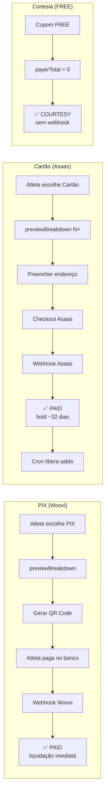
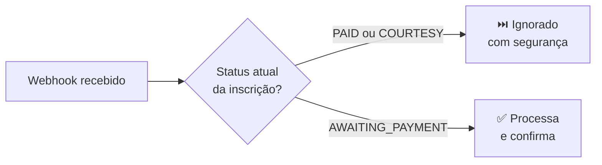

O Passo Giro suporta dois métodos: **PIX** via <Tooltip tip="Gateway de pagamentos instantâneos via QR Code PIX.">Woovi</Tooltip> e **cartão de crédito** via <Tooltip tip="Gateway de pagamentos com cartão, suporta parcelamento e antecipação de recebíveis.">Asaas</Tooltip>. O roteamento é automático com base no `PaymentMethodConfig` do evento.

---

## Visão geral dos fluxos



---

## Fluxo PIX (Woovi)

<Tabs>
  <Tab title="Passo a passo" icon="list-ol">
    <Steps>
      <Step title="Atleta abre a página de pagamento">
        O frontend verifica se já existe um PIX ativo para a inscrição. Se houver, **restaura o QR Code existente** sem criar nova cobrança.
      </Step>
      <Step title="Aplicar cupom (opcional)">
        Frontend chama `previewPaymentBreakdown`. Backend calcula via FeeEngine e retorna o breakdown ao vivo — nenhum pagamento é criado ainda.
      </Step>
      <Step title="Clicar em 'Gerar QR Code PIX'">
        Frontend chama `initiatePayment(method=PIX)`. Backend:

        1. Valida o cupom (se houver)
        2. Calcula via FeeEngine
        3. `WooviAdapter` → cria cobrança na Woovi
        4. Persiste `Payment` com status `AWAITING_PAYMENT`
        5. Retorna QR Code + código copia-cola
      </Step>
      <Step title="QR Code exibido — validade 30 min">
        Frontend exibe o QR Code e fica ouvindo via WebSocket.
      </Step>
      <Step title="Webhook Woovi confirma">
        Backend recebe `POST /payments/webhook/woovi`, chama `markPaymentAsPaid()`.
        Saldo creditado em `totalNetReceived` **imediatamente**.
      </Step>
      <Step title="Inscrição confirmada">
        Frontend recebe via WebSocket, exibe tela de sucesso e comprovante.
      </Step>
    </Steps>
  </Tab>
  <Tab title="Sequência técnica" icon="diagram-project">
    ```mermaid
    sequenceDiagram
      actor Atleta
      participant FE as Frontend
      participant BE as Backend
      participant Woovi

      Atleta->>FE: Escolhe PIX
      FE->>BE: previewPaymentBreakdown(coupon?)
      BE-->>FE: breakdown (sem criar pagamento)
      Atleta->>FE: Clica "Gerar QR Code"
      FE->>BE: initiatePayment(PIX)
      BE->>Woovi: Criar cobrança
      Woovi-->>BE: QR Code + expiresAt
      BE-->>FE: QR Code
      FE-->>Atleta: Exibe QR Code (30 min)
      Atleta->>Woovi: Paga no app do banco
      Woovi->>BE: POST /webhook/woovi
      BE->>BE: markPaymentAsPaid()
      BE-->>FE: WebSocket: PAID
      FE-->>Atleta: Tela de sucesso
    ```
  </Tab>
</Tabs>

<Check>
**Cupom FREE:** não gera cobrança na Woovi. Backend detecta `payerTotalCents = 0`, cria `Payment` com status `COURTESY` e confirma a inscrição imediatamente — sem webhook necessário.
</Check>

---

## Fluxo Cartão de Crédito (Asaas)

<Tabs>
  <Tab title="Passo a passo" icon="list-ol">
    <Steps>
      <Step title="Atleta escolhe Cartão de crédito">
        Frontend chama `previewPaymentBreakdown` para cada número de parcelas disponíveis e exibe os valores com gross-up já incluído.
      </Step>
      <Step title="Preencher endereço e escolher parcelas">
        Endereço completo é **obrigatório** pela Asaas — salvo no perfil do atleta antes de prosseguir.
      </Step>
      <Step title="Clicar em 'Pagar com Cartão'">
        Frontend chama `initiatePayment(method=CREDIT_CARD, installments=N)`. Backend:

        1. Valida o cupom (se houver)
        2. Calcula via FeeEngine (com gross-up)
        3. `AsaasAdapter` → cria sessão de checkout
        4. Persiste `Payment` com status `AWAITING_PAYMENT`
        5. Retorna URL de checkout hospedada pela Asaas
      </Step>
      <Step title="Redireciona para checkout Asaas">
        Frontend abre link em nova aba. Tela interna fica em modo "aguardando" com polling.
      </Step>
      <Step title="Webhook Asaas confirma">
        Backend recebe `POST /payments/webhook/asaas`, chama `markPaymentAsPaid()`.
        Valor vai para `totalPendingClearance` (hold padrão: 32 dias).
      </Step>
      <Step title="Cron job libera o saldo">
        Tarefa diária verifica `availableAt ≤ agora` e move o valor de
        `totalPendingClearance` → `totalNetReceived`. Veja [Liquidação](/sistema/liquidacao).
      </Step>
    </Steps>
  </Tab>
  <Tab title="Sequência técnica" icon="diagram-project">
    ```mermaid
    sequenceDiagram
      actor Atleta
      participant FE as Frontend
      participant BE as Backend
      participant Asaas
      participant Cron

      Atleta->>FE: Escolhe Cartão N×
      FE->>BE: previewPaymentBreakdown(CARD, N, coupon?)
      BE-->>FE: breakdown com gross-up
      Atleta->>FE: Confirma endereço + parcelas
      FE->>BE: initiatePayment(CARD, N)
      BE->>Asaas: Criar checkout
      Asaas-->>BE: checkoutUrl
      BE-->>FE: checkoutUrl
      FE-->>Atleta: Redireciona para Asaas
      Atleta->>Asaas: Preenche dados do cartão
      Asaas->>BE: POST /webhook/asaas
      BE->>BE: markPaymentAsPaid() → totalPendingClearance
      BE-->>FE: WebSocket: PAID
      FE-->>Atleta: Tela de sucesso
      Note over Cron,BE: Após settlementHoldDays dias
      Cron->>BE: Verificar availableAt ≤ agora
      BE->>BE: CLEARED → totalNetReceived
    ```
  </Tab>
</Tabs>

<Info>
**Gross-up cartão:** o valor cobrado do atleta já inclui a taxa da Asaas embutida. O objetivo é garantir que, após a Asaas deduzir (ex: 3,49% + R$0,49) mais a antecipação, a plataforma receba exatamente o `expectedNetCents` alvo. Veja [Taxas e Cálculos](/sistema/taxas-calculos).
</Info>

---

## Roteamento de pagamentos

O `PaymentRoutingService` resolve qual adapter usar com base no `PaymentMethodConfig` do evento:

| Método | Gateway padrão |
|--------|---------------|
| PIX | <Badge color="green" size="sm">Woovi</Badge> |
| Cartão | <Badge color="blue" size="sm">Asaas</Badge> |

Se o organizador não tiver um gateway configurado para o método escolhido, a opção não é exibida para o atleta.

---

## Idempotência de webhooks

O sistema protege contra processamento duplicado. Ao receber um webhook:



---

## correlationId — rastreamento de pagamentos

| Tipo de pagamento | Formato do `correlationId` |
|-------------------|---------------------------|
| Inscrição nova | `{registrationId}` |
| Diferença de troca de categoria | `{registrationId}-change-{changeId}` |

---

## Status da inscrição × fluxo de pagamento

| Status | <Badge color="gray" size="xs">Quando ocorre</Badge> |
|--------|------|
| `PENDING` | Inscrição criada, sem cobrança gerada |
| `AWAITING_PAYMENT` | Cobrança criada, aguardando pagamento |
| `PAID` | Pagamento confirmado via webhook |
| `COURTESY` | Cupom FREE — confirmação direta, sem webhook |
| `EXPIRED` | Prazo expirou sem pagamento |
| `CANCELLED` | Inscrição cancelada |
| `REFUNDED` | Valor devolvido ao atleta |
