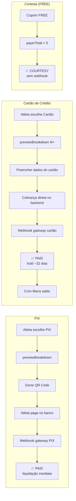
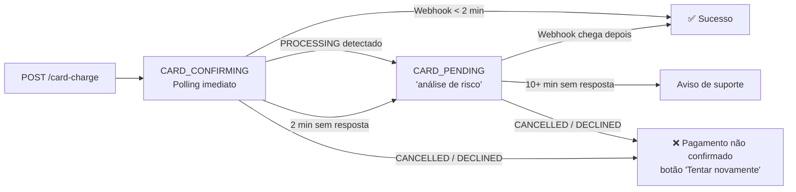
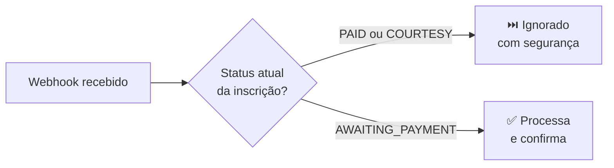
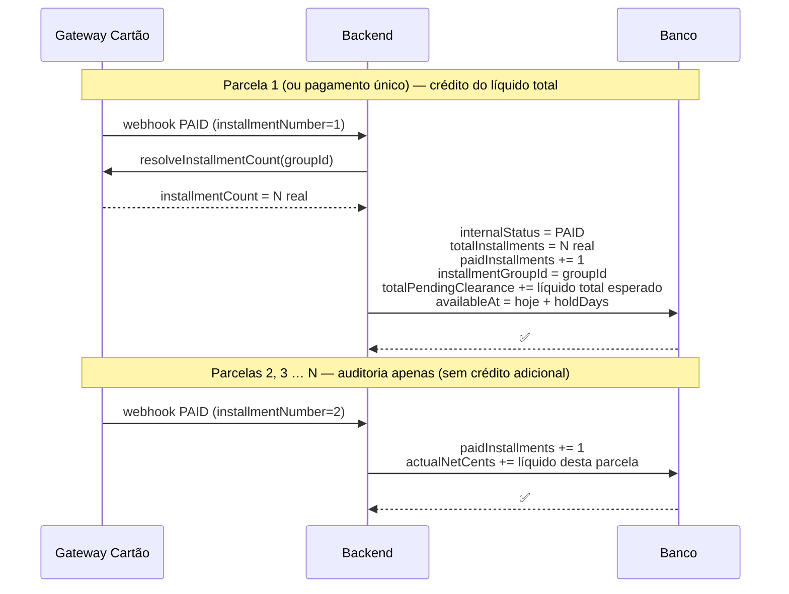

O Passo Giro suporta **PIX** e **cartão de crédito**. O gateway utilizado para cada método é configurável por evento via `PaymentMethodConfig` — trocar ou adicionar um gateway não exige alteração no frontend.

---

## Visão geral dos fluxos



---

## Fluxo PIX

<Tabs>
  <Tab title="Passo a passo" icon="list-ol">
    <Steps>
      <Step title="Atleta abre a página de pagamento">
        O frontend verifica se já existe um PIX ativo para a inscrição. Se houver, **restaura o QR Code existente** sem criar nova cobrança.
      </Step>
      <Step title="Aplicar cupom (opcional)">
        Frontend chama `previewPaymentBreakdown`. Backend calcula via FeeEngine e retorna o breakdown ao vivo — nenhum pagamento é criado ainda.
      </Step>
      <Step title="Clicar em 'Gerar QR Code PIX'">
        Frontend chama `initiatePayment(method=PIX)`. Backend:

        1. Valida o cupom (se houver)
        2. Calcula via FeeEngine
        3. Gateway PIX → cria cobrança
        4. Persiste `Payment` com status `AWAITING_PAYMENT`
        5. Retorna QR Code + código copia-cola
      </Step>
      <Step title="QR Code exibido — validade 30 min">
        Frontend exibe o QR Code com timer de contagem regressiva.
        Polling inicia com **delay inicial de 10 segundos** — aguarda o atleta pagar antes da primeira consulta.
        O intervalo entre consultas **decai 25% a cada poll**, com mínimo de 5 s.
      </Step>
      <Step title="Webhook confirma">
        Backend recebe `POST /payments/webhook/{provider}`, chama `markPaymentAsPaid()`.
        Saldo creditado em `totalNetReceived` **imediatamente**.
      </Step>
      <Step title="Inscrição confirmada">
        Polling detecta o status `PAID`, exibe tela de sucesso e comprovante com QR Code de check-in.
      </Step>
    </Steps>
  </Tab>
  <Tab title="Sequência técnica" icon="diagram-project">
    ```mermaid
    sequenceDiagram
      actor Atleta
      participant FE as Frontend
      participant BE as Backend
      participant GW as Gateway PIX

      Atleta->>FE: Escolhe PIX
      FE->>BE: previewPaymentBreakdown(coupon?)
      BE-->>FE: breakdown (sem criar pagamento)
      Atleta->>FE: Clica "Gerar QR Code"
      FE->>BE: initiatePayment(PIX)
      BE->>GW: Criar cobrança
      GW-->>BE: QR Code + expiresAt
      BE-->>FE: QR Code
      FE-->>Atleta: Exibe QR Code (30 min)
      Note over FE: Polling: 10 s delay, depois decaimento 25%
      Atleta->>GW: Paga no app do banco
      GW->>BE: POST /payments/webhook/{provider}
      BE->>BE: markPaymentAsPaid()
      Note over FE,BE: Próximo poll detecta PAID
      FE-->>Atleta: Tela de sucesso
    ```
  </Tab>
</Tabs>

<Check>
**Cupom FREE:** não gera cobrança no gateway. Backend detecta `payerTotalCents = 0`, cria `Payment` com status `COURTESY` e confirma a inscrição imediatamente — sem webhook necessário.
</Check>

---

## Fluxo Cartão de Crédito

O cartão é processado **diretamente no backend** — o atleta preenche os dados do cartão na própria página do Passo Giro, sem redirecionamento para checkout externo.

<Tabs>
  <Tab title="Passo a passo" icon="list-ol">
    <Steps>
      <Step title="Atleta escolhe Cartão de crédito">
        Frontend chama `previewPaymentBreakdown` para cada número de parcelas disponíveis e exibe os valores com gross-up já incluído.
      </Step>
      <Step title="Preencher endereço e escolher parcelas">
        Endereço completo é **obrigatório** pelo gateway de cartão — salvo no perfil do atleta antes de prosseguir.
      </Step>
      <Step title="Preencher dados do cartão">
        O atleta informa nome do titular, número, validade e CVV diretamente na tela do Passo Giro.
      </Step>
      <Step title="Clicar em 'Pagar com Cartão'">
        Frontend chama `POST /registrations/card-charge`. Backend:

        1. Valida o cupom (se houver)
        2. Calcula via FeeEngine (com gross-up)
        3. Submete cobrança diretamente ao gateway de cartão
        4. Persiste `Payment` com status `AWAITING_PAYMENT`
        5. Retorna indicação de pendente

        Se o backend retornar HTTP 504 (timeout de gateway), o frontend entra em `CARD_CONFIRMING` igualmente — a cobrança pode ter sido processada mesmo sem resposta.
      </Step>
      <Step title="Aguardando confirmação (CARD_CONFIRMING)">
        Frontend entra em `CARD_CONFIRMING` com spinner. Polling inicia **imediatamente** (sem delay inicial) — o atleta acabou de pagar, confirmação tende a chegar em segundos.
        Intervalo inicial: 5 s com decaimento de 25%, mínimo 5 s.
      </Step>
      <Step title="Análise de risco (PROCESSING) — se aplicável">
        Se o gateway colocar o pagamento em análise antifraude, o backend retorna `internalStatus = PROCESSING`. O frontend avança imediatamente para **CARD_PENDING** exibindo: *"Seu pagamento está em análise de risco pela operadora. Isso pode levar alguns minutos."*
      </Step>
      <Step title="Webhook confirma">
        Backend recebe `POST /payments/webhook/{provider}`, chama `markPaymentAsPaid()`.
        Valor vai para `totalPendingClearance` (hold padrão: 32 dias).
      </Step>
      <Step title="Cron job libera o saldo">
        Tarefa diária verifica `availableAt ≤ agora` e move o valor de
        `totalPendingClearance` → `totalNetReceived`. Veja [Liquidação](/sistema/liquidacao).
      </Step>
    </Steps>
  </Tab>
  <Tab title="Sequência técnica" icon="diagram-project">
    ```mermaid
    sequenceDiagram
      actor Atleta
      participant FE as Frontend
      participant BE as Backend
      participant GW as Gateway Cartão
      participant Cron

      Atleta->>FE: Escolhe Cartão N×
      FE->>BE: previewPaymentBreakdown(CARD, N, coupon?)
      BE-->>FE: breakdown com gross-up
      Atleta->>FE: Confirma endereço + parcelas
      Atleta->>FE: Preenche dados do cartão
      FE->>BE: POST /registrations/card-charge
      BE->>GW: Cobrança direta (direct charge)
      GW-->>BE: Resultado (aprovado / análise)
      BE-->>FE: CARD_CONFIRMING
      Note over FE: Polling imediato, 5 s intervalos
      GW->>BE: POST /payments/webhook/{provider}
      BE->>BE: markPaymentAsPaid() → totalPendingClearance
      Note over FE,BE: Polling detecta PAID
      FE-->>Atleta: Tela de sucesso
      Note over Cron,BE: Após settlementHoldDays dias
      Cron->>BE: Verificar availableAt ≤ agora
      BE->>BE: CLEARED → totalNetReceived
    ```
  </Tab>
</Tabs>

<Info>
**Gross-up cartão:** o valor cobrado do atleta já inclui a taxa do gateway embutida. O objetivo é garantir que, após o gateway deduzir sua taxa mais a antecipação (se configurada), a plataforma receba exatamente o `expectedNetCents` alvo. Veja [Taxas e Cálculos](/sistema/taxas-calculos).
</Info>

---

## Estados do checkout de cartão



### CARD_CONFIRMING

Estado ativo logo após a submissão do cartão. Exibe spinner e texto *"Confirmando pagamento..."*. O polling inicia imediatamente (sem delay).

Se `internalStatus = PROCESSING` for detectado no polling, o frontend avança para `CARD_PENDING` **sem esperar os 2 minutos do timer**.

Após 2 minutos sem resposta, o frontend transita automaticamente para `CARD_PENDING`.

### CARD_PENDING

Estado de espera longa. Exibe *"Pagamento em processamento"*. Polling continua ativo (5 s, decaimento, mínimo 5 s).

- Se `internalStatus = PROCESSING`: exibe bloco informativo *"A operadora está verificando a transação por segurança."*
- Após **10 minutos** sem confirmação: exibe aviso âmbar *"Estamos aguardando há mais de N minuto(s). Se não receber a confirmação em breve, entre em contato com o suporte informando seu número de inscrição."*

### Cartão recusado / cancelado

Quando o polling retorna `CANCELLED` ou `EXPIRED` para um pagamento de cartão, o frontend exibe a tela **"Pagamento não confirmado"** com botão *"Tentar novamente"*. O motivo da recusa (campo `obs`) é exibido quando disponível (ex: *"Saldo insuficiente"*, *"Dados do cartão inválidos"*).

---

## PAYMENT_PENDING — checkout em aberto (legado)

Quando o atleta abre `/pagamento/{id}` **sem** o parâmetro `?status=...` (por exemplo, fechou a aba durante um checkout externo gerado por versão anterior da plataforma) e há um pagamento de cartão com `checkoutUrl` ativo em `AWAITING_PAYMENT`, o frontend entra no estado `PAYMENT_PENDING`:

- Exibe **"Aguardando pagamento"** — informa que há um checkout em andamento
- Polling ativo: confirma automaticamente quando o webhook chegar
- Botão **"Trocar método de pagamento"** retorna ao SELECT para iniciar novo pagamento

<Info>
Para eventos com a configuração atual (cobrança direta), este estado raramente ocorrerá. Ele cobre inscrições criadas com a versão anterior da plataforma que usava checkout externo.
</Info>

---

## Polling de status

O frontend consulta periodicamente o status do pagamento durante o fluxo ativo. O polling **não usa WebSocket** — é baseado em requisições HTTP periódicas.

### Comportamento por método

| Método | Delay inicial | Intervalo base | Decaimento | Mínimo |
|--------|---------------|----------------|------------|--------|
| PIX | 10 s | 15 s | 25% por poll | 5 s |
| Cartão | 0 s (imediato) | 5 s | 25% por poll | 5 s |

O decaimento reduz o intervalo a cada consulta bem-sucedida:
```
15 s → 11,25 s → 8,44 s → 6,33 s → 5 s (mínimo)
```

### Page Visibility

Quando o atleta troca de aplicativo (ex: para pagar no app do banco), o polling é **pausado**. Ao retornar à aba do navegador, uma consulta é disparada **imediatamente** — sem esperar o próximo intervalo. Isso garante que o atleta veja a confirmação instantaneamente ao voltar.

### Parada do polling

O polling para automaticamente quando:
- Status terminal é detectado: `PAID`, `EXPIRED`, `CANCELLED`, `REFUNDED`, `REGISTRATION_EXPIRED`
- Erro fatal de rede (não-transiente, ex: `UNAUTHENTICATED`)

Erros transientes (`INTERNAL_SERVER_ERROR`, `NETWORK_ERROR`, falha de conexão) **não param** o polling — a próxima tentativa ocorre normalmente.

---

## Sanitização de texto nos gateways

O campo de descrição do pagamento é sanitizado automaticamente antes de ser enviado ao gateway:

- **Emojis e símbolos pictográficos** (`\p{Extended_Pictographic}`) são removidos — ex: "🏃 Corrida 9ª Festa" → "Corrida 9ª Festa"
- **Caracteres de controle ASCII** (`0x00–0x1F`, `0x7F`) são removidos
- **Espaços múltiplos** são colapsados e o texto é trimado
- **Truncagem** configura-se por gateway (ex: limite de 30 caracteres no campo de item); o truncate respeita a sanitização (nunca deixa trailing space)

Isso evita erros de validação causados por caracteres não aceitos em nomes de eventos ou categorias.

---

## Roteamento de pagamentos

O `PaymentRoutingService` resolve qual adapter usar com base no `PaymentMethodConfig` do evento:

| Método | Gateway padrão (configurável) |
|--------|-------------------------------|
| PIX | Gateway PIX definido no evento (fallback: env `PIX_PAYMENT_GATEWAY`) |
| Cartão | Gateway de cartão definido no evento (fallback: env `CARD_PAYMENT_GATEWAY`) |

Se o evento não tiver um `PaymentMethodConfig` ativo para o método escolhido, essa opção não é exibida para o atleta.

---

## Idempotência de webhooks

O sistema protege contra processamento duplicado. Ao receber um webhook:



---

## correlationId — rastreamento de pagamentos

| Tipo de pagamento | Formato do `correlationId` |
|-------------------|---------------------------|
| Inscrição nova | `{registrationId}` |
| Diferença de troca de categoria | `{registrationId}-change-{changeId}` |

Erros relacionados ao `correlationId` que o frontend pode receber como tipo `GENERIC` (exibidos como erro inline na tela de seleção, sem redirecionar para uma tela de erro):

| Erro | Causa |
|------|-------|
| `INVALID_CORRELATION_ID` | O `correlationId` não corresponde a nenhum formato esperado pelo backend |
| `PAYMENT_PROCESSING` | Já existe um pagamento em estado `PROCESSING` para esta inscrição — aguardar conclusão antes de iniciar novo |

---

## internalStatus e obs

### internalStatus

O campo `internalStatus` retornado pelo `checkPaymentStatus` representa o status **interno** do sistema para o pagamento — independente do código raw retornado pelo gateway. O frontend o usa para determinar o status efetivo:

| `internalStatus` | Comportamento no frontend |
|------------------|---------------------------|
| `EXPIRED` | Sobreescreve o status do gateway — exibe tela de expirado |
| `CANCELLED` | Sobreescreve o status do gateway — exibe tela de cancelado/pagamento não confirmado |
| `PROCESSING` | Se em `CARD_CONFIRMING` → avança imediatamente para `CARD_PENDING` com aviso de análise de risco |
| Demais | Frontend usa o status do gateway (`result.status`) como-é |

**Por que é necessário:** provedores de gateway retornam códigos proprietários (ex: `REPROVED_BY_RISK_ANALYSIS`) que o frontend não reconhece. O `internalStatus` normaliza esses valores antes de chegarem ao cliente.

### obs

O campo `obs` é um texto livre opcional registrado pelo backend em transições de estado relevantes (especialmente `CANCELLED`, `PROCESSING`, `ERROR`). Quando presente, é retornado no payload de `checkPaymentStatus` e exibido na tela **"Pagamento não confirmado"** como motivo para o atleta.

Exemplos de valores registrados pelos adapters de gateway:
- `"Reprovado por análise de risco"`
- `"Dados do cartão inválidos"`
- `"Limite de crédito insuficiente"`

### Snapshot platformFeeMode

No momento da criação do pagamento, o `platformFeeMode` ativo no evento é salvo como snapshot no registro `Payment`. Isso garante que a exibição histórica (ex: aba Financeiro do organizador) mostre o modo correto mesmo que o organizador altere a configuração posteriormente.

---

## Rastreamento de parcelas confirmadas

Para pagamentos parcelados via cartão, o sistema registra individualmente cada parcela confirmada pelo banco, permitindo auditoria e controle de repasse ao organizador.

### Campos na tabela `Payment`

| Campo | Tipo | Descrição |
|-------|------|-----------|
| `totalInstallments` | `Int?` | Número de parcelas **efetivamente escolhido** pelo atleta (corrigido via webhook se diferente do frontend) |
| `paidInstallments` | `Int` | Quantas parcelas o banco já confirmou (começa em `0`) |
| `installmentGroupId` | `String?` | ID do grupo de parcelamento no gateway. Todas as N confirmações de um mesmo parcelamento compartilham este ID |

### Fluxo de confirmações



### Correção de `totalInstallments`

O atleta seleciona no frontend o **número máximo de parcelas** que aceita. No checkout direto do gateway, ele pode confirmar um número menor. O webhook da primeira parcela dispara uma consulta à API do gateway para obter o total real:

```
Frontend informa: 3×
Atleta escolhe no gateway: 2×
Webhook parcela 1 chega → backend consulta grupo → installmentCount = 2
Payment.totalInstallments atualizado: 3 → 2
```

Isso garante que `totalInstallments` reflita sempre a escolha real do atleta, e não apenas o limite máximo configurado pelo organizador.

### Idempotência por parcela

| Situação | Comportamento |
|----------|--------------|
| Webhook duplicado da **parcela 1** | Ignorado — `internalStatus = PAID` bloqueia reprocessamento antes de qualquer alteração em `totalPendingClearance` |
| Webhook duplicado de **parcela 2+** | `totalPendingClearance` não é afetado (parcelas 2+ são somente auditoria). O campo `paidInstallments` pode ser incrementado novamente em caso de reenvio pelo gateway |
| Parcelas **fora de ordem** | Seguro — todos os campos usam `{ increment }`, não SET absoluto |

<Info>
O `installmentGroupId` permite consultar todas as confirmações de um parcelamento com um único filtro. Útil para auditoria e para calcular quanto já foi recebido de um parcelamento específico.
</Info>

### Exemplo de auditoria

```
Parcelamento 5× — R$58,04 total cobrado do atleta

paidInstallments  = 3       → banco confirmou 3 de 5 parcelas
totalInstallments = 5
installmentGroupId = "abc123"

totalPendingClearance → creditado integralmente na parcela 1
  (líquido total = amount − moneyRate − gatewayFeeAmount)

actualNetCents → acumulado parcela a parcela:
  parcela 1: +R$X  |  parcela 2: +R$X  |  parcela 3: +R$X
  (para conciliação com o esperado após hold)

Parcelas ainda pendentes de confirmação bancária: 2 (4 e 5)
```

<Info>
O organizador vê o valor total em **"Aguardando liquidação"** desde a confirmação da parcela 1. O campo `paidInstallments` é informativo — não muda o saldo.
</Info>

---

## Status da inscrição × fluxo de pagamento

| Status | <Badge color="gray" size="xs">Quando ocorre</Badge> |
|--------|------|
| `PENDING` | Inscrição criada, sem cobrança gerada |
| `AWAITING_PAYMENT` | Cobrança criada, aguardando pagamento |
| `PAID` | Pagamento confirmado via webhook |
| `COURTESY` | Cupom FREE — confirmação direta, sem webhook |
| `EXPIRED` | Prazo expirou sem pagamento |
| `CANCELLED` | Inscrição cancelada (manualmente ou por gateway) |
| `REFUNDED` | Valor devolvido ao atleta — inscrição inativa |
