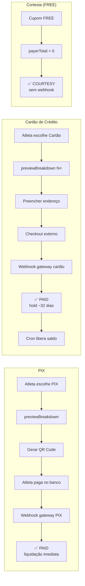
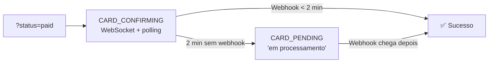
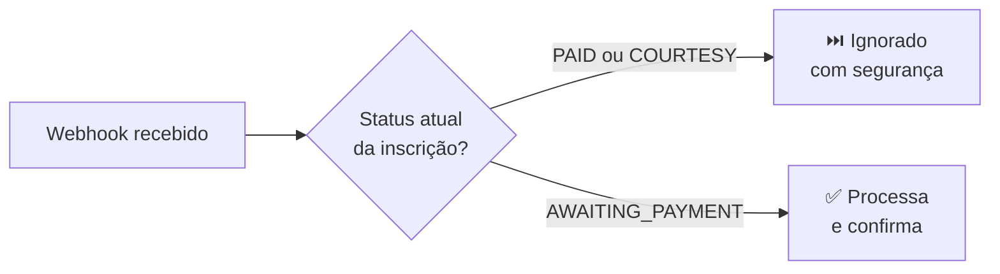
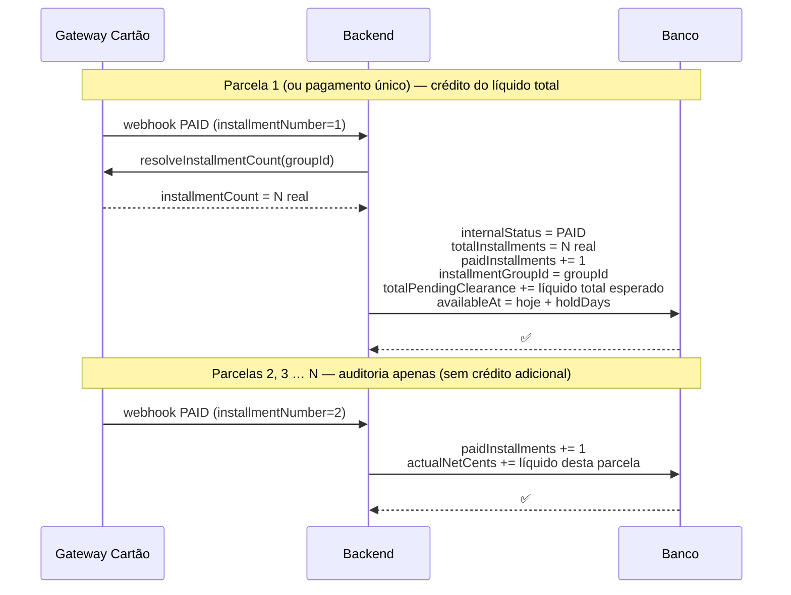

O Passo Giro suporta **PIX** e **cartão de crédito**. O gateway utilizado para cada método é configurável por evento via `PaymentMethodConfig` — trocar ou adicionar um gateway não exige alteração no frontend.

---

## Visão geral dos fluxos



---

## Fluxo PIX

<Tabs>
  <Tab title="Passo a passo" icon="list-ol">
    <Steps>
      <Step title="Atleta abre a página de pagamento">
        O frontend verifica se já existe um PIX ativo para a inscrição. Se houver, **restaura o QR Code existente** sem criar nova cobrança.
      </Step>
      <Step title="Aplicar cupom (opcional)">
        Frontend chama `previewPaymentBreakdown`. Backend calcula via FeeEngine e retorna o breakdown ao vivo — nenhum pagamento é criado ainda.
      </Step>
      <Step title="Clicar em 'Gerar QR Code PIX'">
        Frontend chama `initiatePayment(method=PIX)`. Backend:

        1. Valida o cupom (se houver)
        2. Calcula via FeeEngine
        3. Gateway PIX → cria cobrança
        4. Persiste `Payment` com status `AWAITING_PAYMENT`
        5. Retorna QR Code + código copia-cola
      </Step>
      <Step title="QR Code exibido — validade 30 min">
        Frontend exibe o QR Code e fica ouvindo via WebSocket.
      </Step>
      <Step title="Webhook confirma">
        Backend recebe `POST /payments/webhook/{provider}`, chama `markPaymentAsPaid()`.
        Saldo creditado em `totalNetReceived` **imediatamente**.
      </Step>
      <Step title="Inscrição confirmada">
        Frontend recebe via WebSocket, exibe tela de sucesso e comprovante.
      </Step>
    </Steps>
  </Tab>
  <Tab title="Sequência técnica" icon="diagram-project">
    ```mermaid
    sequenceDiagram
      actor Atleta
      participant FE as Frontend
      participant BE as Backend
      participant GW as Gateway PIX

      Atleta->>FE: Escolhe PIX
      FE->>BE: previewPaymentBreakdown(coupon?)
      BE-->>FE: breakdown (sem criar pagamento)
      Atleta->>FE: Clica "Gerar QR Code"
      FE->>BE: initiatePayment(PIX)
      BE->>GW: Criar cobrança
      GW-->>BE: QR Code + expiresAt
      BE-->>FE: QR Code
      FE-->>Atleta: Exibe QR Code (30 min)
      Atleta->>GW: Paga no app do banco
      GW->>BE: POST /payments/webhook/{provider}
      BE->>BE: markPaymentAsPaid()
      BE-->>FE: WebSocket: PAID
      FE-->>Atleta: Tela de sucesso
    ```
  </Tab>
</Tabs>

<Check>
**Cupom FREE:** não gera cobrança no gateway. Backend detecta `payerTotalCents = 0`, cria `Payment` com status `COURTESY` e confirma a inscrição imediatamente — sem webhook necessário.
</Check>

---

## Fluxo Cartão de Crédito

<Tabs>
  <Tab title="Passo a passo" icon="list-ol">
    <Steps>
      <Step title="Atleta escolhe Cartão de crédito">
        Frontend chama `previewPaymentBreakdown` para cada número de parcelas disponíveis e exibe os valores com gross-up já incluído.
      </Step>
      <Step title="Preencher endereço e escolher parcelas">
        Endereço completo é **obrigatório** pelo gateway de cartão — salvo no perfil do atleta antes de prosseguir.
      </Step>
      <Step title="Clicar em 'Pagar com Cartão'">
        Frontend chama `initiatePayment(method=CREDIT_CARD, installments=N)`. Backend:

        1. Valida o cupom (se houver)
        2. Calcula via FeeEngine (com gross-up)
        3. Gateway de cartão → cria sessão de checkout hospedada
        4. Persiste `Payment` com status `AWAITING_PAYMENT`
        5. Retorna URL de checkout externo
      </Step>
      <Step title="Redireciona para checkout externo">
        Frontend redireciona para a URL hospedada pelo gateway (`window.location.href = checkoutUrl`). Ao concluir, cancelar ou a sessão expirar, o gateway redireciona de volta — veja [Retorno do checkout externo](#retorno-do-checkout-externo).
      </Step>
      <Step title="Aguardando confirmação (CARD_CONFIRMING)">
        Ao retornar com `?status=paid`, o frontend entra em `CARD_CONFIRMING`: spinner ativo, WebSocket e polling escutando. O webhook pode chegar antes mesmo de o atleta ver a tela.
      </Step>
      <Step title="Webhook confirma">
        Backend recebe `POST /payments/webhook/{provider}`, chama `markPaymentAsPaid()`.
        Valor vai para `totalPendingClearance` (hold padrão: 32 dias).
      </Step>
      <Step title="Cron job libera o saldo">
        Tarefa diária verifica `availableAt ≤ agora` e move o valor de
        `totalPendingClearance` → `totalNetReceived`. Veja [Liquidação](/sistema/liquidacao).
      </Step>
    </Steps>
  </Tab>
  <Tab title="Sequência técnica" icon="diagram-project">
    ```mermaid
    sequenceDiagram
      actor Atleta
      participant FE as Frontend
      participant BE as Backend
      participant GW as Gateway Cartão
      participant Cron

      Atleta->>FE: Escolhe Cartão N×
      FE->>BE: previewPaymentBreakdown(CARD, N, coupon?)
      BE-->>FE: breakdown com gross-up
      Atleta->>FE: Confirma endereço + parcelas
      FE->>BE: initiatePayment(CARD, N)
      BE->>GW: Criar checkout
      GW-->>BE: checkoutUrl
      BE-->>FE: checkoutUrl
      FE-->>Atleta: Redireciona para gateway
      Atleta->>GW: Preenche dados do cartão
      GW->>BE: POST /payments/webhook/{provider}
      BE->>BE: markPaymentAsPaid() → totalPendingClearance
      BE-->>FE: WebSocket: PAID
      FE-->>Atleta: Tela de sucesso
      Note over Cron,BE: Após settlementHoldDays dias
      Cron->>BE: Verificar availableAt ≤ agora
      BE->>BE: CLEARED → totalNetReceived
    ```
  </Tab>
</Tabs>

<Info>
**Gross-up cartão:** o valor cobrado do atleta já inclui a taxa do gateway embutida. O objetivo é garantir que, após o gateway deduzir sua taxa mais a antecipação (se configurada), a plataforma receba exatamente o `expectedNetCents` alvo. Veja [Taxas e Cálculos](/sistema/taxas-calculos).
</Info>

---

## Retorno do checkout externo

Gateways que usam checkout hospedado redirecionam o atleta de volta para a tela de pagamento ao final — seja por confirmação, cancelamento ou expiração. As URLs de retorno são construídas **pelo backend** a partir de variáveis de ambiente e nunca aceitas do cliente:

```
/pagamento/{registrationId}?status=paid&method=CREDIT_CARD
/pagamento/{registrationId}?status=abandoned&method=CREDIT_CARD
/pagamento/{registrationId}?status=expired&method=CREDIT_CARD
```

O frontend lê os dois params ao montar e limpa a URL via `replaceState` para evitar reprocessamento no histórico do browser.

| `status` | Comportamento |
|----------|--------------|
| `paid` | Entra em `CARD_CONFIRMING` — spinner + WebSocket/polling ativos. Se o webhook confirmar em < 2 min → tela de sucesso. Após 2 min sem resposta → `CARD_PENDING` ("em processamento — sua inscrição será confirmada automaticamente"). |
| `abandoned` | Volta ao SELECT com **banner rose**: "Pagamento não concluído — sua inscrição está reservada, tente novamente quando quiser." |
| `expired` | Volta ao SELECT com **banner âmbar**: "A sessão de pagamento expirou — inicie um novo pagamento abaixo." |

O param `method` define qual aba fica pré-selecionada ao voltar ao SELECT. Qualquer gateway futuro que use redirect funciona pelo mesmo mecanismo sem mudança no frontend.

<Info>
O valor `status=success` (gerado por versões anteriores) é aceito como sinônimo de `paid` para compatibilidade com links em trânsito.
</Info>

### Por que não depender só do redirect?



O redirect é apenas um sinal de "o atleta voltou". A confirmação real sempre vem do webhook — o `CARD_CONFIRMING` garante que o atleta veja o resultado correto mesmo se o webhook chegar milissegundos depois do redirect ou se ele fechar a aba e voltar mais tarde.

---

## Sanitização de texto nos gateways

O campo de descrição do pagamento é sanitizado automaticamente antes de ser enviado ao gateway:

- **Emojis e símbolos pictográficos** (`\p{Extended_Pictographic}`) são removidos — ex: "🏃 Corrida 9ª Festa" → "Corrida 9ª Festa"
- **Caracteres de controle ASCII** (`0x00–0x1F`, `0x7F`) são removidos
- **Espaços múltiplos** são colapsados e o texto é trimado
- **Truncagem** configura-se por gateway (ex: limite de 30 caracteres no campo de item); o truncate respeita a sanitização (nunca deixa trailing space)

Isso evita erros de validação causados por caracteres não aceitos em nomes de eventos ou categorias.

---

## Roteamento de pagamentos

O `PaymentRoutingService` resolve qual adapter usar com base no `PaymentMethodConfig` do evento:

| Método | Gateway padrão (configurável) |
|--------|-------------------------------|
| PIX | Gateway PIX definido no evento (fallback: env `PIX_PAYMENT_GATEWAY`) |
| Cartão | Gateway de cartão definido no evento (fallback: env `CARD_PAYMENT_GATEWAY`) |

Se o evento não tiver um `PaymentMethodConfig` ativo para o método escolhido, essa opção não é exibida para o atleta.

---

## Idempotência de webhooks

O sistema protege contra processamento duplicado. Ao receber um webhook:



---

## correlationId — rastreamento de pagamentos

| Tipo de pagamento | Formato do `correlationId` |
|-------------------|---------------------------|
| Inscrição nova | `{registrationId}` |
| Diferença de troca de categoria | `{registrationId}-change-{changeId}` |

---

## Rastreamento de parcelas confirmadas

Para pagamentos parcelados via cartão, o sistema registra individualmente cada parcela confirmada pelo banco, permitindo auditoria e controle de repasse ao organizador.

### Campos na tabela `Payment`

| Campo | Tipo | Descrição |
|-------|------|-----------|
| `totalInstallments` | `Int?` | Número de parcelas **efetivamente escolhido** pelo atleta (corrigido via webhook se diferente do frontend) |
| `paidInstallments` | `Int` | Quantas parcelas o banco já confirmou (começa em `0`) |
| `installmentGroupId` | `String?` | ID do grupo de parcelamento no gateway. Todas as N confirmações de um mesmo parcelamento compartilham este ID |

### Fluxo de confirmações



### Correção de `totalInstallments`

O atleta seleciona no frontend o **número máximo de parcelas** que aceita. No checkout externo do gateway, ele pode escolher um número menor. O webhook da primeira parcela dispara uma consulta à API do gateway para obter o total real:

```
Frontend informa: 3×
Atleta escolhe no checkout: 2×
Webhook parcela 1 chega → backend consulta grupo → installmentCount = 2
Payment.totalInstallments atualizado: 3 → 2
```

Isso garante que `totalInstallments` reflita sempre a escolha real do atleta, e não apenas o limite máximo configurado pelo organizador.

### Idempotência por parcela

| Situação | Comportamento |
|----------|--------------|
| Webhook duplicado da **parcela 1** | Ignorado — `internalStatus = PAID` bloqueia reprocessamento antes de qualquer alteração em `totalPendingClearance` |
| Webhook duplicado de **parcela 2+** | `totalPendingClearance` não é afetado (parcelas 2+ são somente auditoria). Risco de `paidInstallments` incrementar novamente — na prática, gateways não reenviam confirmações já processadas |
| Parcelas **fora de ordem** | Seguro — todos os campos usam `{ increment }`, não SET absoluto |

<Info>
O `installmentGroupId` permite consultar todas as confirmações de um parcelamento com um único filtro. Útil para auditoria e para calcular quanto já foi recebido de um parcelamento específico.
</Info>

### Exemplo de auditoria

```
Parcelamento 5× — R$58,04 total cobrado do atleta

paidInstallments  = 3       → banco confirmou 3 de 5 parcelas
totalInstallments = 5
installmentGroupId = "abc123"

totalPendingClearance → creditado integralmente na parcela 1
  (líquido total = amount − moneyRate − gatewayFeeAmount)

actualNetCents → acumulado parcela a parcela:
  parcela 1: +R$X  |  parcela 2: +R$X  |  parcela 3: +R$X
  (para conciliação com o esperado após hold)

Parcelas ainda pendentes de confirmação bancária: 2 (4 e 5)
```

<Info>
O organizador vê o valor total em **"Aguardando liquidação"** desde a confirmação da parcela 1. O campo `paidInstallments` é informativo — não muda o saldo.
</Info>

---

## Status da inscrição × fluxo de pagamento

| Status | <Badge color="gray" size="xs">Quando ocorre</Badge> |
|--------|------|
| `PENDING` | Inscrição criada, sem cobrança gerada |
| `AWAITING_PAYMENT` | Cobrança criada, aguardando pagamento |
| `PAID` | Pagamento confirmado via webhook |
| `COURTESY` | Cupom FREE — confirmação direta, sem webhook |
| `EXPIRED` | Prazo expirou sem pagamento |
| `CANCELLED` | Inscrição cancelada |
| `REFUNDED` | Valor devolvido ao atleta |
