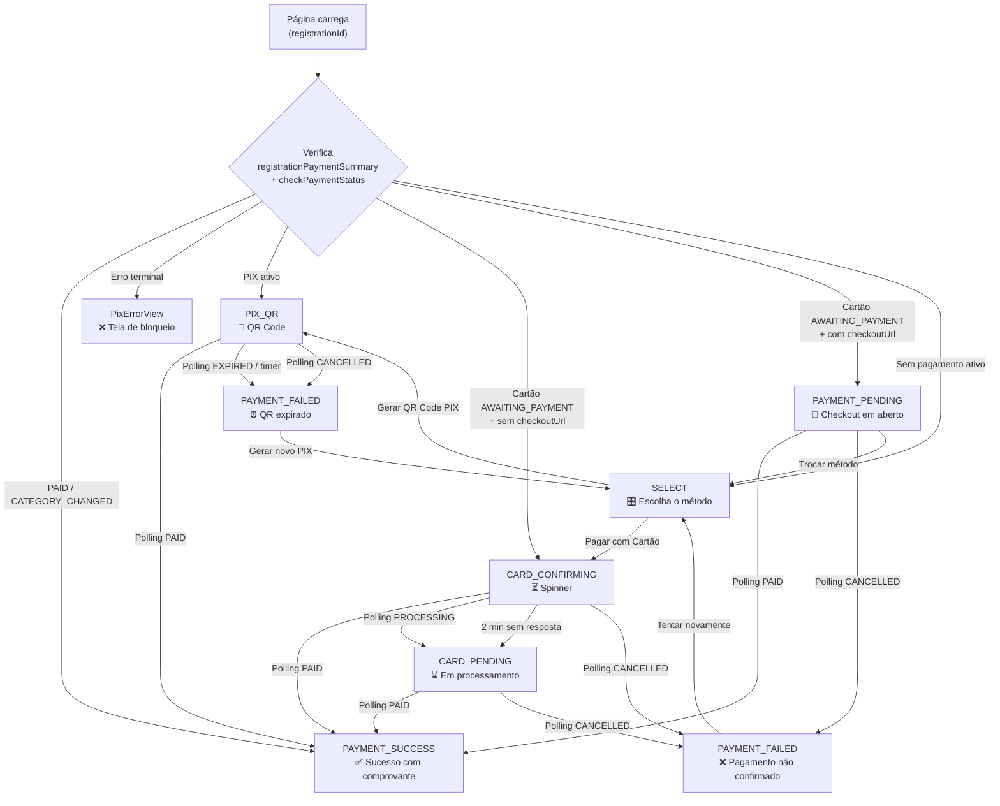

A página `/pagamento/{registrationId}` é um único componente que renderiza telas diferentes dependendo do estado atual do pagamento. Este catálogo documenta **todas as telas possíveis**, os textos exibidos, as condições de ativação e as ações disponíveis.

---

## Diagrama geral de navegação

---

## Telas do fluxo normal

### SELECT — Escolha do método de pagamento

**Condição:** Nenhum pagamento ativo encontrado, ou atleta clicou em "Trocar método de pagamento".

**O que aparece:**
- Resumo da inscrição (evento, categoria, valor base)
- Abas ou seções para cada método disponível: **PIX** e/ou **Cartão de crédito**
- Campo de cupom de desconto (aplicável antes de qualquer pagamento)
- Se cartão: escolha de número de parcelas com valores calculados por `previewPaymentBreakdown`
- Se cartão: campos de endereço de cobrança (obrigatório), dados do titular, número, validade e CVV
- Banner de aviso quando retorna de checkout abandonado/expirado

**Ações:**
- **"Gerar QR Code PIX"** → inicia `initiatePayment(PIX)` → vai para `PIX_QR`
- **"Pagar com Cartão"** → chama `POST /registrations/card-charge` → vai para `CARD_CONFIRMING`

<Info>
O resumo de valores (previewBreakdown) é chamado automaticamente ao abrir o SELECT e sempre que o atleta troca de número de parcelas — sem criar pagamento.
</Info>

---

### PIX_QR — QR Code aguardando pagamento

**Condição:** `initiatePayment(PIX)` retornou com sucesso, ou PIX ativo detectado na carga da página.

**Gateway:** Woovi

**O que aparece:**
- Timer de contagem regressiva (validade de 30 minutos)
- Código copia-cola PIX (botão "Copiar código")
- QR Code opcional (botão "Exibir QR Code")
- Indicador de conexão: ponto verde/âmbar + texto "Verificando em Xs..." / "Verificando..."
- Botão "Já paguei, verificar agora" (modo autenticado)
- Botão "Trocar método de pagamento"

**Polling:** inicia com delay de **10 segundos**; intervalo decai 25% a cada consulta (15 s → 11,25 s → … → 5 s mínimo); disparo imediato ao voltar para a aba do navegador.

**Transições automáticas:**
- Polling retorna `PAID` → `PAYMENT_SUCCESS`
- Polling retorna `EXPIRED` / `CANCELLED` → `PAYMENT_FAILED` ("Código PIX expirado")
- Polling retorna `REGISTRATION_EXPIRED` / `REGISTRATION_CANCELLED` / `REGISTRATION_REFUNDED` → `PixErrorView` correspondente
- Timer de expiração chega a zero → `PAYMENT_FAILED`

---

### CARD_CONFIRMING — Confirmando pagamento (cartão)

**Condição:** `POST /registrations/card-charge` retornou com sucesso (ou HTTP 504 — timeout de gateway).

**Gateway:** Asaas

**O que aparece:**
- Spinner de carregamento (animação circular)
- Texto: **"Confirmando pagamento..."**
- Subtexto: *"Aguardando confirmação do banco. Isso leva alguns instantes."*
- Informativo: *"Seu pagamento já foi enviado e será confirmado automaticamente. Você pode fechar esta página e voltar depois."*
- Botão "Ver minhas inscrições"

**Polling:** inicia **imediatamente** (sem delay); intervalo base 5 s com decaimento de 25%, mínimo 5 s.

**Transições automáticas:**
- Polling retorna `PAID` → `PAYMENT_SUCCESS`
- Polling retorna `PROCESSING` → `CARD_PENDING` (imediato, sem esperar timer)
- Polling retorna `CANCELLED` → `PAYMENT_FAILED` ("Pagamento não confirmado")
- Timer de 2 minutos sem resposta → `CARD_PENDING`

---

### CARD_PENDING — Pagamento em processamento (cartão)

**Condição:** CARD_CONFIRMING após 2 minutos sem resposta do webhook, **ou** polling detectou `internalStatus = PROCESSING` durante CARD_CONFIRMING.

**Gateway:** Asaas

**O que aparece:**
- Ícone de ampulheta (Hourglass)
- Título: **"Pagamento em processamento"**
- Subtexto:
  - Situação normal: *"Seu pagamento está sendo processado pela operadora. Sua inscrição será confirmada automaticamente."*
  - Análise de risco: *"Seu pagamento está em análise de risco pela operadora. Isso pode levar alguns minutos."*
- Bloco informativo de análise de risco (visível apenas quando `internalStatus = PROCESSING`): *"A operadora do cartão está verificando a transação por segurança. Você receberá a confirmação assim que a análise for concluída."*
- Indicador de polling: ponto verde/âmbar + "Verificando em Xs..." / "Verificando..."
- Após **10 minutos** sem confirmação: bloco âmbar *"Estamos aguardando há mais de N minuto(s). Se não receber a confirmação em breve, entre em contato com o suporte informando seu número de inscrição."*
- Botão "Ver minhas inscrições"

**Polling:** continua ativo com intervalo de 5 s.

**Transições automáticas:**
- Polling retorna `PAID` → `PAYMENT_SUCCESS`
- Polling retorna `CANCELLED` → `PAYMENT_FAILED` ("Pagamento não confirmado")

---

### PAYMENT_PENDING — Checkout de cartão em aberto (legado)

**Condição:** Carga da página detectou pagamento de cartão com `checkoutUrl` ativo em `AWAITING_PAYMENT` (sem parâmetro `?status=...` na URL).

**Gateway:** Asaas (versão com checkout externo)

**O que aparece:**
- Ícone de cartão de crédito
- Título: **"Aguardando pagamento"**
- Subtítulo: *"Checkout de cartão em aberto"*
- Descrição: *"Um checkout de cartão foi aberto. Finalize o pagamento para confirmar a inscrição."*
- Indicador de polling + countdown
- Link/botão para reabrir o checkout externo no gateway (abre em nova aba)
- Botão "Trocar método de pagamento"

**Polling:** ativo, intervalo de 15 s (modo PIX).

**Transições automáticas:**
- Polling retorna `PAID` → `PAYMENT_SUCCESS`
- Polling retorna `CANCELLED` ou `EXPIRED` com `paymentMethod = CREDIT_CARD` → `PAYMENT_FAILED` ("Pagamento não confirmado")

<Note>
Este estado cobre inscrições criadas com a versão anterior da plataforma (checkout externo). Para eventos configurados com cobrança direta (versão atual), este estado raramente ocorre.
</Note>

---

### PAYMENT_SUCCESS — Pagamento confirmado (sucesso)

**Condição:** Polling detectou `PAID`, ou `registrationStatus = PAID` / `CATEGORY_CHANGED`, ou `registrationPaymentSummary` retornou status PAID na carga.

**O que aparece:**
- Animação de confete com emojis esportivos 🏃🥇🏅🎽👟🏆
- Título: **"Inscrição confirmada! 🎉"** (ou **"Categoria trocada! 🎉"** para `CATEGORY_CHANGED`)
- Comprovante completo com:
  - Nome do atleta
  - Nome do evento
  - Categoria (e modalidade, se aplicável)
  - Tamanho da camiseta (se selecionado)
  - Local de retirada do kit (se aplicável)
  - QR Code de check-in
  - Data de expiração do QR Code
- Botão **"Baixar comprovante em PDF"**
- Botão "Ver todas as inscrições"

---

### PAYMENT_FAILED — QR expirado ou pagamento recusado

**Condição:** Polling retorna `EXPIRED` ou `CANCELLED` (para PIX), ou cartão recusado/cancelado (para cartão).

Esta tela tem **duas variantes visuais** dependendo do método:

#### Variante PIX — "Código PIX expirado"

**Condição:** `paymentMethod ≠ CREDIT_CARD` na resposta do polling.

| Elemento | Valor |
|----------|-------|
| Ícone | Relógio (âmbar) |
| Badge | "PIX expirado" |
| Título | "Código PIX expirado" |
| Descrição | Campo `obs` do pagamento, se disponível. Fallback: *"O tempo para pagamento deste código PIX expirou. Você pode gerar um novo PIX."* |
| Botão primário | **"Gerar novo PIX"** → volta ao SELECT |
| Botão secundário | "Voltar para Minhas Inscrições" |

#### Variante Cartão — "Pagamento não confirmado"

**Condição:** `paymentMethod = CREDIT_CARD` na resposta do polling (ou no estado de CARD_CONFIRMING/CARD_PENDING).

| Elemento | Valor |
|----------|-------|
| Ícone | X (vermelho) |
| Badge | "Pagamento recusado" |
| Título | "Pagamento não confirmado" |
| Descrição | Campo `obs` do pagamento, se disponível (ex: *"Saldo insuficiente"*). Fallback: *"Seu pagamento não foi confirmado pela operadora. Verifique os dados do cartão e tente novamente, ou escolha outro método de pagamento."* |
| Botão primário | **"Tentar novamente"** → volta ao SELECT |
| Botão secundário | "Voltar para Minhas Inscrições" |

---

## Telas de erro terminal (PixErrorView)

Estas telas são exibidas quando a inscrição está em um estado que **impede qualquer pagamento**. Não há retorno automático — o atleta só pode navegar para fora.

### NOT_FOUND — Inscrição não encontrada

**Quando:** `errorType = REGISTRATION_NOT_FOUND` em `initiatePayment` ou `checkPaymentStatus`.

| Elemento | Valor |
|----------|-------|
| Ícone | Lupa com X (cinza) |
| Badge | "Não encontrado" |
| Título | "Inscrição não encontrada" |
| Descrição | *"A inscrição informada não existe ou não está mais disponível."* |
| Botão | "Ver Minhas Inscrições" |

---

### FORBIDDEN — Acesso não autorizado

**Quando:** `errorType = FORBIDDEN` — atleta logado não é o dono da inscrição.

| Elemento | Valor |
|----------|-------|
| Ícone | Escudo com X (cinza) |
| Badge | "Sem permissão" |
| Título | "Acesso não autorizado" |
| Descrição | *"Você não tem permissão para acessar este pagamento. Verifique se está logado com a conta correta."* |
| Botão primário | "Ver Minhas Inscrições" |
| Botão secundário | "Trocar de conta" |

---

### REGISTRATION_EXPIRED — Prazo expirado

**Quando:** `errorType = REGISTRATION_EXPIRED` — inscrição no status `EXPIRED`.

| Elemento | Valor |
|----------|-------|
| Ícone | Relógio (âmbar) |
| Badge | "Inscrição expirada" |
| Título | "Prazo de pagamento expirado" |
| Descrição | *"O tempo para realizar o pagamento desta inscrição se esgotou e ela foi cancelada automaticamente."* |
| Botão primário | "Ir para Página do Evento" (nova inscrição) |
| Botão secundário | "Ver Minhas Inscrições" |

---

### REGISTRATION_CANCELLED — Inscrição cancelada

**Quando:** `errorType = REGISTRATION_CANCELLED` — inscrição no status `CANCELLED`.

| Elemento | Valor |
|----------|-------|
| Ícone | X circular (vermelho) |
| Badge | "Inscrição cancelada" |
| Título | "Esta inscrição foi cancelada" |
| Descrição | *"A inscrição foi cancelada e não está mais ativa. Para participar, realize uma nova inscrição."* |
| Botão primário | "Ir para Página do Evento" |
| Botão secundário | "Ver Minhas Inscrições" |

---

### REGISTRATION_REFUNDED — Inscrição reembolsada

**Quando:** `errorType = REGISTRATION_REFUNDED` — inscrição no status `REFUNDED`.

| Elemento | Valor |
|----------|-------|
| Ícone | Seta de retorno (índigo) |
| Badge | "Reembolso realizado" |
| Título | "Inscrição reembolsada" |
| Descrição | *"O pagamento desta inscrição foi estornado e ela foi encerrada."* |
| Botão primário | "Ir para Página do Evento" |
| Botão secundário | "Ver Minhas Inscrições" |

---

### REGISTRATION_COURTESY — Inscrição cortesia

**Quando:** `errorType = REGISTRATION_COURTESY` — inscrição com cupom FREE (status `COURTESY`).

| Elemento | Valor |
|----------|-------|
| Ícone | Presente (verde) |
| Badge | "Inscrição cortesia" |
| Título | "Você está inscrito!" |
| Descrição | *"Esta é uma inscrição cortesia — não é necessário realizar nenhum pagamento."* |
| Botão | "Ver Minhas Inscrições" |

<Note>
Variante especial: quando a cortesia é detectada via `REGISTRATION_ALREADY_PAID` no modo público, o sistema carrega e exibe o **comprovante completo** (tela `PAYMENT_SUCCESS`) em vez desta tela de bloqueio.
</Note>

---

### REGISTRATION_PENDING — Inscrição em análise

**Quando:** `errorType = REGISTRATION_PENDING` — inscrição criada manualmente pelo organizador, aguarda aprovação.

| Elemento | Valor |
|----------|-------|
| Ícone | Ampulheta (azul) |
| Badge | "Aguardando confirmação" |
| Título | "Inscrição em análise" |
| Descrição | *"Sua inscrição está pendente de aprovação pelo organizador do evento."* |
| Botão | "Acompanhar Inscrição" |

---

### AWAITING_CATEGORY_CHANGE — Troca em andamento

**Quando:** `errorType = AWAITING_CATEGORY_CHANGE` — inscrição no status `AWAITING_CATEGORY_CHANGE`, acessada diretamente (não pelo fluxo de troca).

| Elemento | Valor |
|----------|-------|
| Ícone | Setas de troca (violeta) |
| Badge | "Troca de categoria" |
| Título | "Mudança de categoria em andamento" |
| Descrição | *"Esta inscrição está aguardando a conclusão de uma troca de categoria."* |
| Botão | "Ver Minhas Inscrições" |

---

### CATEGORY_CHANGE_NOT_FOUND — PIX de troca não localizado

**Quando:** `errorType = CATEGORY_CHANGE_NOT_FOUND` — pagamento de diferença da troca não encontrado.

| Elemento | Valor |
|----------|-------|
| Ícone | Círculo de alerta (âmbar) |
| Badge | "Não encontrado" |
| Título | "PIX de troca não encontrado" |
| Descrição | *"Não foi possível localizar o PIX referente à troca de categoria. Inicie o processo de troca novamente."* |
| Botão | "Voltar para Minhas Inscrições" |

---

### GENERIC — Erro inesperado

**Quando:** Qualquer erro não mapeado nos tipos acima, ou `errorType` desconhecido.

| Elemento | Valor |
|----------|-------|
| Ícone | Círculo de alerta (vermelho) |
| Badge | "Erro" |
| Título | "Não foi possível gerar o PIX" |
| Descrição | *"Ocorreu um erro inesperado. Tente novamente ou entre em contato com o suporte."* |
| Botão primário | "Tentar novamente" → volta ao SELECT |
| Botão secundário | "Ver Minhas Inscrições" |

<Note>
Os erros `PAYMENT_PROCESSING` e `INVALID_CORRELATION_ID` **não** geram uma PixErrorView — são exibidos como **erro inline** dentro do SELECT, sem sair da tela de seleção de método.
</Note>

---

## Tabela resumo: tela × condição × gateway

| Tela | PIX (Woovi) | Cartão (Asaas) | Condição principal |
|------|:-----------:|:--------------:|-------------------|
| SELECT | ✅ | ✅ | Sem pagamento ativo |
| PIX_QR | ✅ | ❌ | PIX criado, aguardando |
| CARD_CONFIRMING | ❌ | ✅ | Cobrança direta submetida |
| CARD_PENDING | ❌ | ✅ | 2 min ou PROCESSING detectado |
| PAYMENT_PENDING | ❌ | ✅ | Checkout externo em aberto (legado) |
| PAYMENT_SUCCESS | ✅ | ✅ | Qualquer pagamento confirmado |
| PAYMENT_FAILED (QR) | ✅ | ❌ | PIX expirou ou cancelado |
| PAYMENT_FAILED (Cartão) | ❌ | ✅ | Cartão recusado |
| NOT_FOUND | ✅ | ✅ | ID inválido |
| FORBIDDEN | ✅ | ✅ | Sem permissão |
| REGISTRATION_EXPIRED | ✅ | ✅ | Inscrição expirada |
| REGISTRATION_CANCELLED | ✅ | ✅ | Inscrição cancelada |
| REGISTRATION_REFUNDED | ✅ | ✅ | Estorno realizado |
| REGISTRATION_COURTESY | ✅ | ✅ | Inscrição cortesia |
| REGISTRATION_PENDING | ✅ | ✅ | Aguarda aprovação manual |
| AWAITING_CATEGORY_CHANGE | ✅ | ✅ | Troca em andamento |
| CATEGORY_CHANGE_NOT_FOUND | ✅ | ✅ | PIX de troca não localizado |
| GENERIC | ✅ | ✅ | Erro inesperado |

---

## Modo público (`?public=1`)

Quando a URL contém `?public=1`, a autenticação não é exigida. Isso permite que organizadores compartilhem o link de pagamento com atletas que ainda não têm conta.

**Diferenças no modo público:**
- PIX criado via `getOrInitiatePaymentByToken` (mutation pública, sem JWT)
- Polling usa `checkPaymentStatusByToken` (query pública)
- Botão "Já paguei, verificar agora" **não aparece** (requer autenticação)
- Comprovante carregado via `generateCheckoutTokenPublic` (sem dados sensíveis do organizador)
- `UNAUTHENTICATED` não redireciona para login — exibe erro genérico
